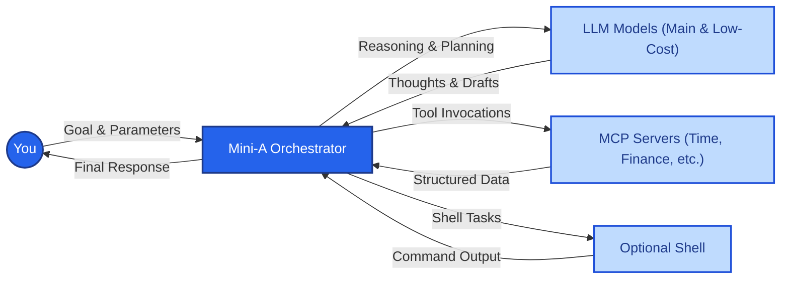

# OpenAF mini-a


Mini-A is a minimalist autonomous agent that uses LLMs, shell commands and/or MCP servers to achieve user-defined goals. Simple, flexible, and easy to use as a library, CLI tool, or embedded interface.


> **⚡ New Performance Optimizations!** Mini-A now includes automatic optimizations that reduce token usage by 40-60% and costs by 50-70% with zero configuration. [Learn more →](docs/WHATS-NEW.md)



## Quick Start

Two steps to use:

1. Set `OAF_MODEL` environment variable to the model you want to use:
   ```bash
   export OAF_MODEL="(type: openai, model: gpt-5-mini, key: '...', timeout: 900000, temperature: 1)"
   ```

   Use the built-in model manager when you prefer to store encrypted
   definitions instead of exporting raw environment variables:
   ```bash
   mini-a modelman=true
   ```
   The manager lets you create, import, rename, export, and delete reusable
   definitions that can then be exported as `OAF_MODEL`/`OAF_LC_MODEL` values or copied as raw SLON/JSON for sharing.

2. Run the console:
   ```bash
   opack exec mini-a
   ```
   Type your goal at the prompt, or pass it inline:
   ```bash
   opack exec mini-a goal="your goal"
   ```
   If you enabled the optional alias displayed after installation, simply run `mini-a ...`.
   For a colorized overview of every console, web, and planning flag (including shared Mini-A arguments), run `mini-a -h` or `mini-a --help`; the console prints the CLI-specific switches followed by the auto-generated table of core agent parameters.
   Inside the console you can inspect active parameters with slash commands; `/show` lists them all and `/show use` filters to parameters beginning with `use`. Conversation cleanup commands are also available: `/compact [n]` condenses older user/assistant turns into a single summary message while keeping the most recent `n` exchanges, and `/summarize [n]` generates a full narrative summary entry that replaces the earlier history while preserving the latest messages so the session can continue with a condensed context window. When you need to revisit prior output, `/last [md]` reprints the previous final answer (add `md` to emit the raw Markdown), and `/save <path>` writes that answer directly to disk.

   **Tab-complete tips**: Slash commands that accept file paths (such as `/save`) now support inline filesystem completion, so you can press <kbd>Tab</kbd> to expand directories and filenames instead of typing the whole path.

   **Tip**: Include file contents in your goals using `@path/to/file` syntax (e.g., `Follow these instructions @docs/guide.md`).

Shell access is disabled by default for safety; add `useshell=true` when you explicitly want the agent to run commands.

For browser UI, start `./mini-a-web.sh onport=8888` after exporting the model settings and open `http://localhost:8888`.

### Running in Docker

Mini-A can run in Docker containers for isolated execution and portability:

**CLI console:**
```bash
docker run --rm -ti \
  -e OPACKS=mini-a -e OPACK_EXEC=mini-a \
  -e OAF_MODEL="(type: openai, model: gpt-5-mini, key: '...', timeout: 900000)" \
  openaf/oaf:edge
```

**Web interface:**
```bash
docker run -d --rm \
  -e OPACKS=mini-a -e OPACK_EXEC=mini-a \
  -e OAF_MODEL="(type: openai, model: gpt-5-mini, key: '...', timeout: 900000)" \
  -p 12345:12345 \
  openaf/oaf:edge onport=12345
```

**Goal execution:**
```bash
docker run --rm \
  -e OPACKS=mini-a \
  -e OAF_MODEL="(type: openai, model: gpt-5-mini, key: '...', timeout: 900000)" \
  openaf/oaf:edge \
  ojob mini-a/mini-a.yaml goal="your goal here" useshell=true
```

See [USAGE.md](USAGE.md#running-mini-a-in-docker) for comprehensive Docker examples including multiple MCPs, AWS Bedrock, planning workflows, and more.

### Simple Examples

**List files:**
```bash
mini-a goal="list all JavaScript files in this directory" useshell=true
```

**Using MCP servers:**
```bash
mini-a goal="what time is it in Sydney?" mcp="(cmd: 'ojob mcps/mcp-time.yaml', timeout: 5000)"
```

**Testing MCP servers interactively:**
```bash
mini-a mcptest=true mcp="(cmd: 'ojob mcps/mcp-time.yaml')"
```

**Aggregate MCP tools via proxy (single tool exposed):**
```bash
mini-a goal="compare release dates across APIs" \
  usetools=true mcpproxy=true \
  mcp="[(cmd: 'ojob mcps/mcp-time.yaml'), (cmd: 'ojob mcps/mcp-fin.yaml')]" \
  useutils=true
```
This keeps the LLM context lean by exposing a single `proxy-dispatch` tool even when multiple MCP servers and the Mini Utils Tool are active. See [docs/MCPPROXY-FEATURE.md](docs/MCPPROXY-FEATURE.md) for a deep dive.

**Chatbot mode:**
```bash
mini-a goal="help me plan a vacation in Lisbon" chatbotmode=true
```

## Installation

1. Install OpenAF from [openaf.io](https://openaf.io)
2. Install oPack:
   ```bash
   opack install mini-a
   ```
3. Set your model configuration (see Quick Start above)
4. Start using Mini-A via `opack exec mini-a` (or the `mini-a` alias if you added it)!

## Testing MCP Servers

Mini-A includes an interactive MCP server testing tool that helps you test and debug MCP servers before integrating them into your workflows.

### Using the MCP Tester

Launch the MCP tester console:
```bash
mini-a mcptest=true
```

Or connect to an MCP server directly:
```bash
mini-a mcptest=true mcp="(cmd: 'ojob mcps/mcp-time.yaml')"
```

For HTTP remote MCP servers:
```bash
mini-a mcptest=true mcp="(type: remote, url: 'http://localhost:9090/mcp')"
```

### MCP Tester Features

The interactive tester provides:

- **Connection Management** - Connect to both STDIO (local command) and HTTP Remote MCP servers
- **Tool Discovery** - List all available tools from the connected MCP server
- **Tool Inspection** - View detailed information about tool parameters, types, and descriptions
- **Interactive Tool Calling** - Call any MCP tool with custom parameters through guided prompts
- **Configuration Options** - Adjust settings like debug mode, tool selection display size, and result parsing
- **Library Loading** - Load additional OpenAF libraries for extended functionality using `libs=` parameter

### Available Options

- `mcp` - MCP server configuration (SLON/JSON string or object)
- `libs` - Comma-separated list of libraries to load (e.g., `libs="@mini-a/custom.js,helper.js"`)
- `debug` - Enable debug mode for detailed MCP connection logging (can be toggled in the interactive menu)

### Example Session

```bash
# Launch the tester
mini-a mcptest=true

# 1. Choose "New connection"
# 2. Select "STDIO (local command)"
# 3. Enter: ojob mcps/mcp-time.yaml
# 4. Choose "List tools" to see available tools
# 5. Choose "Call a tool" to test a specific tool
# 6. Follow the prompts to enter parameters
```

The tester includes automatic cleanup with shutdown handlers to properly close MCP connections when exiting.

## Features

- **Multi-Model Support** - Works with OpenAI, Google Gemini, GitHub Models, AWS Bedrock, Ollama, and more
- **Dual-Model Cost Optimization** - Use a low-cost model for routine steps with smart escalation (see [USAGE.md](USAGE.md#dual-model-setup-cost-optimization))
- **Built-in Performance Optimizations** - Automatic context management, dynamic escalation, and parallel action support deliver 40-60% token reduction and 50-70% cost savings (see [docs/OPTIMIZATIONS.md](docs/OPTIMIZATIONS.md))
- **MCP Integration** - Seamless integration with Model Context Protocol servers (STDIO & HTTP)
  - **Dynamic Tool Selection** - Intelligent filtering of MCP tools using stemming, synonyms, n-grams, and fuzzy matching (`mcpdynamic=true`)
  - **Tool Caching** - Smart caching for deterministic and read-only tools to avoid redundant operations
  - **Circuit Breakers** - Automatic connection health management with cooldown periods
  - **Lazy Initialization** - Deferred MCP connection establishment for faster startup (`mcplazy=true`)
  - **Proxy Aggregation** - Collapse all MCP connections (including Mini Utils Tool) into a single `proxy-dispatch` tool to minimize context usage (`mcpproxy=true`)
- **Built-in MCP Servers** - Database, file system, network, time/timezone, email, S3, RSS, Yahoo Finance, SSH, and more
- **MCP Self-Hosting** - Expose Mini-A itself as a MCP server via `mcps/mcp-mini-a.yaml` (remote callers can run goals with limited formatting/planning overrides while privileged flags stay server-side)
- **Optional Shell Access** - Execute shell commands with safety controls and sandboxing
- **Web UI** - Lightweight embedded chat interface for interactive use
- **Planning Mode** - Generate and execute structured task plans for complex goals
  - **Plan Validation** - LLM-based critique validates plans before execution
  - **Dynamic Replanning** - Automatic plan adjustments when obstacles occur
  - **Phase Verification** - Auto-generated verification tasks ensure phase completion
  - **Mode Presets** - Quick configuration bundles (shell, chatbot, web, etc.) - see [USAGE.md](USAGE.md#mode-presets); set `OAF_MINI_A_MODE` to pick a default when `mode=` is omitted
- **Conversation Persistence** - Save and resume conversations across sessions
- **Rate Limiting** - Built-in rate limiting for API usage control
- **Metrics & Observability** - Comprehensive runtime metrics for monitoring and cost tracking
- **Enhanced Visual Output** - UTF-8 box-drawing characters, ANSI color codes, and emoji for rich terminal displays (`useascii=true`)
- **Interactive Maps** - Ask the agent to return Leaflet map snippets for geographic prompts, rendered directly in the console transcript and web UI (`usemaps=true`)

## Documentation

- **[What's New](docs/WHATS-NEW.md)** - Latest performance improvements and migration guide
- **[Quick Reference Cheatsheet](CHEATSHEET.md)** - Fast lookup for all parameters and common patterns
- **[Performance Optimizations](docs/OPTIMIZATIONS.md)** - Built-in optimizations for token reduction and cost savings
- **[MCP Proxy Guide](docs/MCPPROXY-FEATURE.md)** - How to consolidate multiple MCP connections behind one `proxy-dispatch` tool
- **[Usage Guide](USAGE.md)** - Comprehensive guide covering all features
  - [Getting Started](USAGE.md#basic-usage)
  - [Model Configuration](USAGE.md#model-configuration)
  - [Mode Presets](USAGE.md#mode-presets)
  - [Advanced Features](USAGE.md#advanced-features)
  - [Planning Workflow](USAGE.md#planning-workflow)
  - [MCP Integration Deep Dive](USAGE.md#mcp-integration-deep-dive)
  - [Security Considerations](USAGE.md#security-considerations)
  - [Metrics and Observability](USAGE.md#metrics-and-observability)
- **[MCP Documentation](mcps/README.md)** - Built-in MCP servers catalog
- **[Creating MCPs](mcps/CREATING.md)** - Build custom MCP integrations
- **[External MCPs](mcps/EXTERNAL-MCPS.md)** - Community MCP servers
- **[Contributing Guide](CONTRIBUTING.md)** - Join the project
- **[Code of Conduct](CODE_OF_CONDUCT.md)** - Community standards

## Project Components

Mini-A ships with complementary components:

- **`mini-a.yaml`** - Core oJob definition that implements the agent workflow
- **`mini-a-con.js`** - Interactive console available through `opack exec mini-a` (or the `mini-a` alias)
- **`mini-a-mcptest.js`** - Interactive MCP server tester for testing and debugging MCP servers
- **`mini-a.sh`** - Shell wrapper script for running directly from a cloned repository
- **`mini-a.js`** - Reusable library for embedding in other OpenAF jobs
- **`mini-a-web.sh` / `mini-a-web.yaml`** - Lightweight HTTP server for browser UI
- **`mini-a-modes.yaml`** - Built-in configuration presets for common use cases (can be extended with `~/.openaf-mini-a_modes.yaml`)
- **`public/`** - Browser interface assets

## Common Configuration Options

| Option | Description | Default |
|--------|-------------|---------|
| `goal` | Objective the agent should achieve | Required |
| `youare` | Override the opening persona sentence in the system prompt (inline text or `@file` path) to craft specialized agents | `"You are a goal-oriented agent running in background."` (Mini-A still appends the step-by-step/no-feedback directives automatically) |
| `chatyouare` | Override the chatbot persona sentence when `chatbotmode=true` (inline text or `@file` path) | `"You are a helpful conversational AI assistant."` |
| `useshell` | Allow shell command execution | `false` |
| `readwrite` | Allow file system modifications | `false` |
| `mcp` | MCP server configuration (single or array) | - |
| `usetools` | Register MCP tools with the model | `false` |
| `mcpproxy` | Aggregate all MCP connections (and Mini Utils Tool) under a single `proxy-dispatch` tool to save context | `false` |
| `chatbotmode` | Conversational assistant mode | `false` |
| `useplanning` | Enable task planning workflow with validation and dynamic replanning | `false` |
| `useascii` | Enable enhanced UTF-8/ANSI visual output with colors and emojis | `false` |
| `usemaps` | Encourage Leaflet-based interactive map outputs for geographic data | `false` |
| `mode` | Apply preset from `mini-a-modes.yaml` or `~/.openaf-mini-a_modes.yaml` | - |
| `modelman` | Launch the interactive model definitions manager | `false` |
| `maxsteps` | Maximum steps before forcing final answer | `15` |
| `rpm` | Rate limit (requests per minute) | - |
| `shellprefix` | Override the prefix appended to each shell command in stored plans | - |
| `verbose` / `debug` | Enable detailed logging | `false` |

For the complete list and detailed explanations, see the [Usage Guide](USAGE.md#configuration-options).

## Setting the Model

Examples for different providers:

**OpenAI:**
```bash
export OAF_MODEL="(type: openai, model: gpt-5-mini, key: ..., timeout: 900000, temperature: 1)"
```

**Google Gemini:**
```bash
export OAF_MODEL="(type: gemini, model: gemini-2.5-flash-lite, key: ..., timeout: 900000, temperature: 0)"
# Required for Gemini models:
export OAF_MINI_A_NOJSONPROMPT=true
```

**GitHub Models:**
```bash
export OAF_MODEL="(type: openai, url: 'https://models.github.ai/inference', model: openai/gpt-5-nano, key: $(gh auth token), timeout: 900000, temperature: 1, apiVersion: '')"
```

**AWS Bedrock (requires OpenAF AWS oPack):**
```bash
export OAF_MODEL="(type: bedrock, timeout: 900000, options: (model: 'amazon.nova-pro-v1:0', temperature: 0))"
```

**Ollama (local):**
```bash
export OAF_MODEL="(type: ollama, model: 'gemma3', url: 'http://ollama.local', timeout: 900000)"
```

**Dual-model for cost optimization:**
```bash
# High-capability model for complex reasoning
export OAF_MODEL="(type: openai, model: gpt-4, key: '...')"
# Low-cost model for routine operations
export OAF_LC_MODEL="(type: openai, model: gpt-3.5-turbo, key: '...')"
```

For more model configurations and recommendations, see [USAGE.md](USAGE.md#model-configuration).

## Security

Mini-A includes built-in security features:

- **Command Filtering** - Dangerous commands blocked by default
- **Interactive Confirmation** - Optional approval for each command (`checkall=true`)
- **Read-Only Mode** - File system protection enabled by default
- **Shell Isolation** - Shell access disabled by default
- **Sandboxing Support** - Use `shell=...` prefix for Docker, Podman, or OS sandboxes

**Example with Docker sandbox:**
```bash
docker run -d --rm --name mini-a-sandbox -v "$PWD":/work -w /work ubuntu:24.04 sleep infinity
mini-a goal="analyze files" useshell=true shell="docker exec mini-a-sandbox"
```

See [USAGE.md](USAGE.md#security-considerations) for detailed security information and sandboxing strategies.

## Contributing

We welcome contributions! Please see our [Contributing Guide](CONTRIBUTING.md) for details on:

- Code contribution process
- Development setup
- Pull request guidelines
- Community standards

### Running Tests

Run the test suite from the repository root:

```bash
ojob tests/autoTestAll.yaml
```

The run generates an `autoTestAll.results.json` file with detailed results—inspect it locally and delete it before your final commit.

## Community

- **Issues**: [GitHub Issues](https://github.com/openaf/mini-a/issues)
- **Discussions**: [GitHub Discussions](https://github.com/openaf/mini-a/discussions)
- **Email**: openaf@openaf.io

Please read our [Code of Conduct](CODE_OF_CONDUCT.md) before participating.

## License

This project is licensed under the Apache License 2.0 - see the [LICENSE](LICENSE) file for details.
