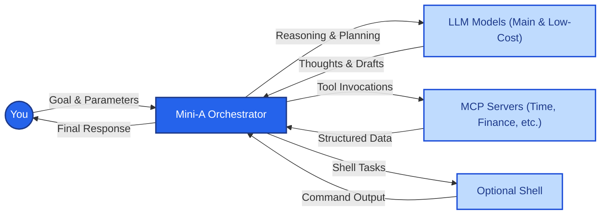

# OpenAF mini-a


Mini-A is a minimalist autonomous agent that uses LLMs, shell commands and/or MCP servers to achieve user-defined goals. Simple, flexible, and easy to use as a library, CLI tool, or embedded interface.


> **⚡ New Performance Optimizations!** Mini-A now includes automatic optimizations that reduce token usage by 40-60% and costs by 50-70% with zero configuration. [Learn more →](docs/WHATS-NEW.md)


```mermaid
flowchart LR
  User((You)) -->|Goal & Parameters| MiniA[Mini-A Orchestrator]
  MiniA -->|Reasoning & Planning| LLM["LLM Models (Main & Low-Cost)"]
  MiniA -->|Tool Invocations| MCP["MCP Servers (Time, Finance, etc.)"]
  MiniA -->|Shell Tasks| Shell["Optional Shell"]
  MCP -->|Structured Data| MiniA
  Shell -->|Command Output| MiniA
  LLM -->|Thoughts & Drafts| MiniA
  MiniA -->|Final Response| User
  classDef node fill:#2563eb,stroke:#1e3a8a,stroke-width:2px,color:#fff
  classDef peripheral fill:#bfdbfe,stroke:#1d4ed8,color:#1e3a8a
  class User node
  class MiniA node
  class LLM,MCP,Shell peripheral
```

## Quick Start

Two steps to use:

1. Set `OAF_MODEL` environment variable to the model you want to use:
   ```bash
   export OAF_MODEL="(type: openai, model: gpt-5-mini, key: '...', timeout: 900000, temperature: 1)"
   ```
   Optional: add `OAF_LC_MODEL` for a low-cost helper model and `OAF_VAL_MODEL` to use a dedicated validation model in deep research mode. You can also override them per run with `modellc=...` and `modelval=...`.

   Use the built-in model manager when you prefer to store encrypted
   definitions instead of exporting raw environment variables:
   ```bash
   mini-a modelman=true
   ```
   The manager lets you create, import, rename, export, and delete reusable
   definitions that can then be exported as `OAF_MODEL`/`OAF_LC_MODEL` values or copied as raw SLON/JSON for sharing.

2. Run the console:
   ```bash
   opack exec mini-a
   ```
   Type your goal at the prompt, or pass it inline:
   ```bash
   opack exec mini-a goal="your goal"
   ```
   If you enabled the optional alias displayed after installation, you can use `mini-a ...` instead.

Shell access is disabled by default for safety; add `useshell=true` when you explicitly want the agent to run commands.

## Next Steps

### Helpful first commands

- Show all console/web/planning flags and defaults:
  ```bash
  mini-a -h
  ```
- Run one custom slash command/skill template without entering interactive mode:
   ```bash
   opack exec mini-a exec="/my-command first second"
   ```
- Print starter templates for reusable console assets:
   ```bash
   mini-a --agent
   mini-a --skill
   mini-a --command
   mini-a --hook
   ```

`exec=` resolves a slash template from `~/.openaf-mini-a/commands/` or `~/.openaf-mini-a/skills/`, renders placeholders, runs the resulting goal (including hooks), and exits.

### Console templates and hooks

- Custom commands: `~/.openaf-mini-a/commands/*.md` (`extracommands=<path1>,<path2>`)
- Skills: `~/.openaf-mini-a/skills/<name>/SKILL.md`, `~/.openaf-mini-a/skills/<name>/SKILL.yaml|yml|json`, or `~/.openaf-mini-a/skills/<name>.md|yaml|yml|json` (`extraskills=<path1>,<path2>`).
- Hooks: `~/.openaf-mini-a/hooks/*.{yaml,yml,json}` with events `before_goal`, `after_goal`, `before_tool`, `after_tool`, `before_shell`, `after_shell` (`extrahooks=<path1>,<path2>`)
- Starter generators: `mini-a --command`, `mini-a --skill`, `mini-a --hook`, `mini-a --agent`

See [USAGE.md](USAGE.md) for full template placeholders, precedence rules, and examples.

### Console productivity tips

- `/show` lists active parameters (`/show use` filters by prefix)
- `/skills [prefix]` lists discovered skills
- `/compact [n]` and `/summarize [n]` condense history
- `/last [md]` reprints the previous final answer
- `/save <path>` writes the previous final answer to disk
- `@path/to/file` inlines file content into goals; use `\@token` for a literal `@token` and `\$token` for a literal `$token`

### Web UI quick start

Start the browser UI:
```bash
./mini-a-web.sh onport=8888
```

Then open `http://localhost:8888`.

For history/attachments and S3-backed history examples, see [USAGE.md](USAGE.md#web-ui-quick-start).

### Running in Docker

Mini-A can run in Docker containers for isolated execution and portability.

#### Simple Docker Usage (Recommended)

The `openaf/mini-a` image comes with Mini-A pre-installed for immediate use:

**CLI console:**
```bash
docker run --rm -ti \
  -e OAF_MODEL="(type: openai, model: gpt-5-mini, key: '...', timeout: 900000)" \
  openaf/mini-a
```

**Console with MCP servers and custom rules:**
```bash
docker run --rm -ti \
  -e OAF_MODEL=$OAF_MODEL \
  -e OAF_LC_MODEL=$OAF_LC_MODEL \
  openaf/mini-a \
  mcp="(cmd: 'ojob mcps/mcp-time.yaml')" \
  rules="- the default time zone is Asia/Tokyo"
```

**Console with knowledge and rules loaded from files:**
```bash
docker run --rm -ti \
  -e OAF_MODEL=$OAF_MODEL \
  -v $(pwd):/work -w /work \
  openaf/mini-a \
  knowledge="$(cat KNOWLEDGE.md)" \
  rules="$(cat RULES.md)"
```

**Web interface:**
```bash
docker run -d --rm \
  -e OAF_MODEL="(type: openai, model: gpt-5-mini, key: '...', timeout: 900000)" \
  -p 12345:12345 \
  openaf/mini-a onport=12345
```

**Web interface with streaming:**
```bash
docker run -d --rm \
  -e OAF_MODEL="(type: openai, model: gpt-5-mini, key: '...', timeout: 900000)" \
  -p 12345:12345 \
  openaf/mini-a onport=12345 usestream=true
```

**Goal execution:**
```bash
docker run --rm \
  -e OAF_MODEL="(type: openai, model: gpt-5-mini, key: '...', timeout: 900000)" \
  openaf/mini-a \
  goal="your goal here" useshell=true
```

#### Advanced Docker Usage

For custom OpenAF installations or specific oPack combinations, use the base image:

**CLI console:**
```bash
docker run --rm -ti \
  -e OPACKS=mini-a -e OPACK_EXEC=mini-a \
  -e OAF_MODEL="(type: openai, model: gpt-5-mini, key: '...', timeout: 900000)" \
  openaf/oaf:edge
```

**Web interface:**
```bash
docker run -d --rm \
  -e OPACKS=mini-a -e OPACK_EXEC=mini-a \
  -e OAF_MODEL="(type: openai, model: gpt-5-mini, key: '...', timeout: 900000)" \
  -p 12345:12345 \
  openaf/oaf:edge onport=12345
```

**Goal execution:**
```bash
docker run --rm \
  -e OPACKS=mini-a \
  -e OAF_MODEL="(type: openai, model: gpt-5-mini, key: '...', timeout: 900000)" \
  openaf/oaf:edge \
  ojob mini-a/mini-a.yaml goal="your goal here" useshell=true
```

See [USAGE.md](USAGE.md#running-mini-a-in-docker) for comprehensive Docker examples including multiple MCPs, AWS Bedrock, planning workflows, and more.

### Simple Examples

**List files:**
```bash
mini-a goal="list all JavaScript files in this directory" useshell=true
```

**Using MCP servers:**
```bash
mini-a goal="what time is it in Sydney?" mcp="(cmd: 'ojob mcps/mcp-time.yaml', timeout: 5000)"
```

`mcp-web` also includes `http-request` for direct HTTP verbs (`GET`, `HEAD`, `POST`, `PUT`, `PATCH`, `DELETE`); use `readwrite=true` when you need mutating verbs.

```bash
mini-a goal="inspect rust-lang.org response headers" \
  mcp="(cmd: 'ojob mcps/mcp-web.yaml', timeout: 5000)"
```

**Testing MCP servers interactively:**
```bash
mini-a mcptest=true mcp="(cmd: 'ojob mcps/mcp-time.yaml')"
```

**Aggregate MCP tools via proxy (single tool exposed):**
```bash
mini-a goal="compare release dates across APIs" \
  usetools=true mcpproxy=true \
  mcp="[(cmd: 'ojob mcps/mcp-time.yaml'), (cmd: 'ojob mcps/mcp-fin.yaml')]" \
  useutils=true
```
This keeps the LLM context lean by exposing a single `proxy-dispatch` tool even when multiple MCP servers and the Mini Utils Tool are active. For large tool payloads, `proxy-dispatch` can also load arguments from `argumentsFile` and save results to a temporary JSON `resultFile` (`resultToFile=true`) to avoid context bloat. Prefer this pattern when `useutils=true` (recommended) or `useshell=true readwrite=true` and payloads are expected to be large. See [docs/MCPPROXY-FEATURE.md](docs/MCPPROXY-FEATURE.md) for a deep dive.

For some tool-calling runs with `gpt-oss-120b`, enabling `usejsontool=true` can improve reliability:

```bash
mini-a goal="what is the current time?" usetools=true mcpproxy=true usejsontool=true
```

This adds a compatibility shim for accidental `json` tool calls and feeds the payload back into Mini-A's normal action flow.

**Chatbot mode:**
```bash
mini-a goal="help me plan a vacation in Lisbon" chatbotmode=true
```

**Real-time streaming:**
```bash
mini-a goal="explain the history of computing" usestream=true
```

## Installation

1. Install OpenAF from [openaf.io](https://openaf.io)
2. Install oPack:
   ```bash
   opack install mini-a
   ```
3. Set your model configuration (see Quick Start above)
4. Start using Mini-A via `opack exec mini-a` (or the `mini-a` alias if you added it)!

## Testing MCP Servers

Mini-A includes an interactive MCP server testing tool that helps you test and debug MCP servers before integrating them into your workflows.

### Using the MCP Tester

Launch the MCP tester console:
```bash
mini-a mcptest=true
```

Or connect to an MCP server directly:
```bash
mini-a mcptest=true mcp="(cmd: 'ojob mcps/mcp-time.yaml')"
```

For HTTP remote MCP servers:
```bash
mini-a mcptest=true mcp="(type: remote, url: 'http://localhost:9090/mcp')"
```

For SSE-based MCP servers:
```bash
mini-a mcptest=true mcp="(type: sse, url: 'http://localhost:9090/mcp')"
```

### MCP Tester Features

The interactive tester provides:

- **Connection Management** - Connect to STDIO, HTTP Remote, HTTP SSE, oJob, dummy, or raw `$mcp(...)` configurations
- **Tool Discovery** - List all available tools from the connected MCP server
- **Tool Inspection** - View detailed information about tool parameters, types, and descriptions
- **Interactive Tool Calling** - Call any MCP tool with custom parameters through guided prompts
- **Advanced Config Support** - Merge extra `$mcp` options such as `shared`, `clientInfo`, `auth`, `strict`, `blacklist`, or future transport flags via JSSLON/JSON
- **Configuration Options** - Adjust settings like debug mode, tool selection display size, and result parsing
- **Library Loading** - Load additional OpenAF libraries for extended functionality using `libs=` parameter

### Available Options

- `mcp` - MCP server configuration (SLON/JSON string or object)
- `libs` - Comma-separated list of libraries to load (e.g., `libs="@mini-a/custom.js,helper.js"`)
- `debug` - Enable debug mode for detailed MCP connection logging (can be toggled in the interactive menu)

### Example Session

```bash
# Launch the tester
mini-a mcptest=true

# 1. Choose "New connection"
# 2. Select "HTTP SSE" or "Raw $mcp config" when you need newer transport/options support
# 3. Enter the URL or the full JSSLON config
# 4. Optionally merge extra $mcp options such as "(shared: true, clientInfo: (name: 'Mini-A MCP Tester'))"
# 5. Choose "List tools" to see available tools
# 6. Choose "Call a tool" to test a specific tool
```

The tester includes automatic cleanup with shutdown handlers to properly close MCP connections when exiting.

## Features

- **Multi-Model Support** - Works with OpenAI, Google Gemini, GitHub Models, AWS Bedrock, Ollama, and more
- **Dual-Model Cost Optimization** - Use a low-cost model for routine steps with smart escalation (see [USAGE.md](USAGE.md#dual-model-setup-cost-optimization))
- **Advisor Strategy Mode** - Optional `modelstrategy=advisor` keeps LC as executor while consulting the main model for difficult steps with centralized gating, strict advisor JSON validation, lightweight no-tool enforcement, and budget-aware consult limits (default mode remains unchanged)
- **Built-in Performance Optimizations** - Automatic context management, dynamic escalation, and parallel action support deliver 40-60% token reduction and 50-70% cost savings (see [docs/OPTIMIZATIONS.md](docs/OPTIMIZATIONS.md))
- **Real-Time Streaming** - Display LLM tokens as they arrive with markdown-aware buffering for smooth rendering (`usestream=true`)
- **MCP Integration** - Seamless integration with Model Context Protocol servers (STDIO & HTTP)
  - **Dynamic Tool Selection** - Intelligent filtering of MCP tools using stemming, synonyms, n-grams, and fuzzy matching (`mcpdynamic=true`)
  - **Tool Caching** - Smart caching for deterministic and read-only tools to avoid redundant operations
  - **Circuit Breakers** - Automatic connection health management with cooldown periods
  - **Lazy Initialization** - Deferred MCP connection establishment for faster startup (`mcplazy=true`)
  - **Proxy Aggregation** - Collapse all MCP connections (including Mini Utils Tool) into a single `proxy-dispatch` tool to minimize context usage (`mcpproxy=true`)
  - **Programmatic Tool Calling** - Optional per-session localhost HTTP bridge for calling MCP tools from scripts executed by the agent (`mcpprogcall=true`, requires `useshell=true`)
- **Built-in MCP Servers** - Database, file system, network, time/timezone, email, S3, RSS, Yahoo Finance, SSH, office documents, and more
- **MCP Self-Hosting** - Expose Mini-A itself as a templatable MCP server via `mcps/mcp-mini-a.yaml`; customize server name, title, tool description, and tool prefix at launch time (`servername=`, `servertitle=`, `tooldesc=`, `toolprefix=`) so a single YAML serves multiple personas without duplication
- **A2A Agent Bridge** - Consume any Google A2A-protocol agent (LangGraph, Vertex AI ADK, CrewAI, …) as MCP tools via `mcps/mcp-a2a.yaml`; discovers skills from `/.well-known/agent.json` Agent Cards and routes tasks via JSON-RPC 2.0
- **Optional Shell Access** - Execute shell commands with safety controls and sandboxing
- **Web UI** - Lightweight embedded chat interface for interactive use with clipboard controls for Markdown and static HTML exports
- **Planning Mode** - Generate and execute structured task plans for complex goals
  - **Simple Plans by Default** - Flat sequential planning is now the default (`planstyle=simple`) for better model compliance
  - **Plan Validation** - LLM-based critique validates plans before execution
  - **Dynamic Replanning** - Automatic plan adjustments when obstacles occur
  - **Legacy Compatibility** - Keep phase-based behavior when needed (`planstyle=legacy`)
  - **Mode Presets** - Quick configuration bundles (shell, chatbot, web, etc.) - see [USAGE.md](USAGE.md#mode-presets); set `OAF_MINI_A_MODE` to pick a default when `mode=` is omitted
- **Sub-Goal Delegation** - Hierarchical task decomposition with concurrent child agents
  - **Local Delegation** - Spawn child Mini-A agents in the same process for parallel subtask execution (`usedelegation=true`)
  - **Remote Worker Routing** - Route delegated subtasks by worker `/info` capabilities/limits plus A2A-compatible `skills`, with round-robin tie-breaks for equivalent workers (set `workers=http://worker1:8080,http://worker2:8080`)
  - **Optional A2A Transport** - Use A2A HTTP+JSON/REST worker endpoints instead of the legacy `/task` protocol (`usea2a=true`)
  - **Dynamic Worker Registration** - Workers can self-register/heartbeat/deregister through a dedicated parent registration server (`workerreg`, `workerregurl`, `workerevictionttl`)
  - **Worker API** - Headless HTTP API for distributed agent workloads across processes/containers/hosts (`mini-a-worker.yaml`)
  - **Autonomous Delegation** - LLM decides when to delegate via `delegate-subtask` tool
  - **Manual Delegation** - Console commands for interactive control (`/delegate`, `/subtasks`, `/subtask`)
  - **Depth Tracking** - Configurable nesting limits with automatic retry and deadline enforcement
- **Conversation Persistence** - Save and resume conversations across sessions (`conversation=...`; in `mini-a-con`, combine `usehistory=true`, `historykeep=true`, and `resume=true` to pick and continue prior console threads stored under `~/.openaf-mini-a/history/`; use `historykeepperiod=` and/or `historykeepcount=` for retention)
- **Rate Limiting** - Built-in rate limiting for API usage control
- **Metrics & Observability** - Comprehensive runtime metrics for monitoring and cost tracking
- **ASCII Sketch Guidance** - Encourage text-based sketch outputs in responses (`useascii=true`)
- **Interactive Maps** - Ask the agent to return Leaflet map snippets for geographic prompts, rendered directly in the console transcript and web UI (`usemaps=true`)
- **Math Formula Rendering** - Encourage LaTeX formulas rendered with KaTeX in the web UI (`usemath=true`)

## Documentation

- **[Mini-A Website](https://mini-a.ai)** - Project home, guides, and announcements
- **[Mini-A Toolkit](https://tk.mini-a.ai)** - Online toolkit and utilities
- **[What's New](docs/WHATS-NEW.md)** - Latest performance improvements and migration guide
- **[Quick Reference Cheatsheet](CHEATSHEET.md)** - Fast lookup for all parameters and common patterns
- **[Performance Optimizations](docs/OPTIMIZATIONS.md)** - Built-in optimizations for token reduction and cost savings
- **[Delegation Guide](docs/DELEGATION.md)** - Hierarchical task decomposition with local and remote delegation
- **[MCP Proxy Guide](docs/MCPPROXY-FEATURE.md)** - How to consolidate multiple MCP connections behind one `proxy-dispatch` tool
- **[Usage Guide](USAGE.md)** - Comprehensive guide covering all features
  - [Getting Started](USAGE.md#basic-usage)
  - [Model Configuration](USAGE.md#model-configuration)
  - [Mode Presets](USAGE.md#mode-presets)
  - [Advanced Features](USAGE.md#advanced-features)
  - [Planning Workflow](USAGE.md#planning-workflow)
  - [MCP Integration Deep Dive](USAGE.md#mcp-integration-deep-dive)
  - [Security Considerations](USAGE.md#security-considerations)
  - [Metrics and Observability](USAGE.md#metrics-and-observability)
- **[MCP Documentation](mcps/README.md)** - Built-in MCP servers catalog
- **[Creating MCPs](mcps/CREATING.md)** - Build custom MCP integrations
- **[External MCPs](mcps/EXTERNAL-MCPS.md)** - Community MCP servers
- **[Contributing Guide](CONTRIBUTING.md)** - Join the project
- **[Code of Conduct](CODE_OF_CONDUCT.md)** - Community standards

## Project Components

Mini-A ships with complementary components:

- **`mini-a.yaml`** - Core oJob definition that implements the agent workflow
- **`mini-a-con.js`** - Interactive console available through `opack exec mini-a` (or the `mini-a` alias)
- **`mini-a-mcptest.js`** - Interactive MCP server tester for testing and debugging MCP servers
- **`mini-a.sh`** - Shell wrapper script for running directly from a cloned repository
- **`mini-a.js`** - Reusable library for embedding in other OpenAF jobs
- **`mini-a-progcall.js`** - Per-session localhost HTTP bridge used by programmatic MCP tool calling (`mcpprogcall=true`)
- **`mini-a-subtask.js`** - SubtaskManager for local child-agent delegation and remote worker delegation
- **`mini-a-web.sh` / `mini-a-web.yaml`** - Lightweight HTTP server for browser UI
- **`mini-a-worker.yaml`** - Headless HTTP API server for programmatic agent delegation (launch with `mini-a workermode=true`)
- **`mini-a-modes.yaml`** - Built-in configuration presets for common use cases (can be extended with `~/.openaf-mini-a_modes.yaml` or `~/.openaf-mini-a/modes.yaml`)
- **`public/`** - Browser interface assets

## Common Configuration Options

| Option | Description | Default |
|--------|-------------|---------|
| `goal` | Objective the agent should achieve | Required |
| `youare` | Override the opening persona sentence in the system prompt (inline text or `@file` path) to craft specialized agents | `"You are a goal-oriented agent running in background."` (Mini-A still appends the step-by-step directive, and adds the no-feedback remark for `mini-a-con`/`mini-a-web`) |
| `chatyouare` | Override the chatbot persona sentence when `chatbotmode=true` (inline text or `@file` path) | `"You are a helpful conversational AI assistant."` |
| `useshell` | Allow shell command execution | `false` |
| `usesandbox` | Apply built-in OS sandbox presets for shell commands (`off`,`auto`,`linux`,`macos`,`windows`); warns and may degrade when the backend is unavailable | `off` |
| `sandboxprofile` | Optional macOS profile path for `sandbox-exec`; when omitted, Mini-A generates a restrictive temporary `.sb` profile | - |
| `sandboxnonetwork` | Disable network inside the built-in sandbox when supported; Windows remains best-effort | `false` |
| `readwrite` | Allow file system modifications | `false` |
| `mcp` | MCP server configuration (single or array) | - |
| `agent` | Path (or inline markdown) containing YAML frontmatter metadata (`model`, `capabilities`, `tools`, `constraints`, `knowledge`, `youare`, `mini-a`). `mini-a` can set any Mini-A args from the file. | - |
| `usetools` | Register MCP tools with the model | `false` |
| `usejsontool` | Enable an optional compatibility `json` tool when `usetools=true` (helps with models that occasionally emit `json` tool calls instead of plain JSON action output) | `false` |
| `useutils` | Auto-register Mini Utils Tool utilities as an MCP connection (`init`, `filesystemQuery`, `filesystemModify`, `markdownFiles`, plus console-only helpers like `userInput` when running `mini-a-con`) | `false` |
| `utilsroot` | Root directory for Mini Utils Tool file operations (only when `useutils=true`) | `.` |
| `utilsallow` | Comma-separated allowlist of Mini Utils Tool names to expose (only when `useutils=true`) | unset |
| `utilsdeny` | Comma-separated denylist of Mini Utils Tool names to hide; applied after `utilsallow` (only when `useutils=true`) | unset |
| `mini-a-docs` | When `true` (and `utilsroot` is unset), sets `utilsroot` to `getOPackPath("mini-a")`; the `markdownFiles` tool description includes the resolved docs root so the LLM can navigate Mini-A documentation directly | `false` |
| `mcpproxy` | Aggregate all MCP connections (and Mini Utils Tool) under a single `proxy-dispatch` tool to save context; supports `argumentsFile` + `resultToFile` for large payload handoff | `false` |
| `adaptiverouting` | Enable adaptive rule-based route selection (direct/MCP/proxy/shell/utility/delegation) with fallback chains and trace output | `false` |
| `routerorder` | Comma-separated preferred route order (e.g. `mcp_direct_call,mcp_proxy_path,shell_execution`) | built-in default |
| `routerallow` | Comma-separated route allowlist applied by the adaptive router | unset |
| `routerdeny` | Comma-separated route denylist applied by the adaptive router | unset |
| `routerproxythreshold` | Payload-size threshold (bytes) where proxy routes are preferred for large requests | falls back to `mcpproxythreshold` |
| `mcpproxytoon` | When `mcpproxythreshold>0`, serialize proxy-spilled results as TOON text (`af.toTOON`) to improve search/read efficiency on large payloads | `false` |
| `mcpprogcall` | Start a per-session localhost HTTP bridge so generated scripts can list/search/call MCP tools programmatically; requires `useshell=true` for script execution | `false` |
| `mcpprogcallport` | Port for the programmatic tool-calling bridge (`0` = auto-assign free port) | `0` |
| `mcpprogcallmaxbytes` | Max inline JSON response size before storing oversized tool results under `/result/{id}` | `4096` |
| `mcpprogcallresultttl` | Time-to-live in seconds for oversized stored results returned by `/result/{id}` | `600` |
| `mcpprogcalltools` | Optional comma-separated allowlist of tool names exposed through the bridge | `""` |
| `mcpprogcallbatchmax` | Max calls accepted per `/call-tools-batch` request | `10` |
| `chatbotmode` | Conversational assistant mode | `false` |
| `promptprofile` | System prompt verbosity profile (`minimal`, `balanced`, `verbose`) | `balanced` |
| `systempromptbudget` | Maximum estimated system-prompt token budget before low-priority sections are dropped | - |
| `useplanning` | Enable task planning workflow with validation and dynamic replanning | `false` |
| `planstyle` | Planning style (`simple` flat steps by default, or `legacy` phase-based) | `simple` |
| `usememory` | Enable structured working memory (`facts`, `evidence`, `openQuestions`, `hypotheses`, `decisions`, `artifacts`, `risks`, `summaries`) maintained across the run | `false` |
| `memoryscope` | Memory scope selector: `session`, `global`, or `both` (session-first lookup when combined) | `both` |
| `memorysessionid` | Optional session id used to isolate ephemeral session memory (defaults to `conversation` or runtime id) | - |
| `memorych` | JSSLON definition for an OpenAF channel used to persist and reload global working memory across runs (e.g. `{type:'file',options:{file:'/tmp/memory.json'}}`). With `memoryscope=both`, default writes go to global when a channel is configured; use explicit session scope for ephemeral entries. | - |
| `memoryuser` | Convenience shorthand: enables `usememory` and sets `memorych`/`memorysessionch` to file channels backed by `~/.openaf-mini-a/memory.json` (only channels not already defined; directory auto-created). | `false` |
| `metricsch` | JSSLON definition for an OpenAF channel used to record periodic Mini-A metrics snapshots (for example `{name:'mini-a-metrics',type:'mvs',options:{file:'/tmp/mini-a-metrics.db'}}`). By default Mini-A stores only the `mini-a` metric; optional `period`, `some`, and `noDate` fields mirror `ow.metrics.startCollecting`. | - |
| `memorymaxpersection` | Per-section memory cap before compaction | `80` |
| `memorymaxentries` | Total memory-entry cap across all sections | `500` |
| `memorycompactevery` | Run compaction/summarization every N memory mutations | `8` |
| `memorydedup` | Deduplicate near-identical memory entries before append | `true` |
| `useascii` | Encourage ASCII sketch outputs in agent responses | `false` |
| `usemaps` | Encourage Leaflet-based interactive map outputs for geographic data | `false` |
| `usemath` | Encourage LaTeX-style math formulas (`$...$`, `$$...$$`) for KaTeX rendering in the web UI | `false` |
| `usestream` | Enable real-time token streaming as LLM generates responses | `false` |
| `mode` | Apply preset from `mini-a-modes.yaml`, `~/.openaf-mini-a_modes.yaml`, or `~/.openaf-mini-a/modes.yaml` | - |
| `modelman` | Launch the interactive model definitions manager | `false` |
| `workermode` | Launch the Worker API server (`mini-a-worker.yaml`) from the console entrypoint | `false` |
| `workers` | Comma-separated list of worker URLs for remote delegation (`workers=http://host1:8080,http://host2:8080`) | - |
| `usea2a` | Use A2A HTTP+JSON/REST binding (`/message:send`, `/tasks`, `/tasks:cancel`) for remote delegation | `false` |
| `workerreg` | Start dynamic worker registration server on the parent instance (port number) | - |
| `workerregtoken` | Bearer token for dynamic worker registration endpoints | - |
| `workerevictionttl` | Heartbeat TTL in milliseconds before dynamic worker eviction | `60000` |
| `workerregurl` | Parent registration endpoint(s) for worker self-registration (`workermode=true`) | - |
| `workerskills` | JSON/SLON array of A2A-style worker skills exposed by `workermode=true` | - |
| `workertags` | Comma-separated tags appended to the default worker skill in `workermode=true` | - |
| `workerreginterval` | Worker registration heartbeat interval in milliseconds | `30000` |
| `maxsteps` | Maximum steps before forcing final answer | `15` |
| `rpm` | Rate limit (requests per minute) | - |
| `tpm` | Rate limit (tokens per minute across prompt + completion) | - |
| `maxcontext` | Context budget in tokens before proactive summarization | `0` |
| `maxcontent` | Alias for `maxcontext` | `0` |
| `outfile` | Path to save final answer output | - |
| `outfileall` | Deep-research-only path to save full cycle output (verdicts/learnings/history) | - |
| `shellprefix` | Override the prefix appended to each shell command in stored plans | - |
| `shelltimeout` | Maximum shell command runtime in milliseconds before timeout | - |
| `shellmaxbytes` | Maximum shell output size (chars) before truncating to a head/tail excerpt with guidance | - |
| `toollog` | JSSLON definition for a dedicated tool-log channel capturing MCP tool inputs/outputs | - |
| `showthinking` | Surface XML-tagged thinking blocks from model responses as thought logs | `false` |
| `secpass` | Password used to unlock OpenAF sBucket model secrets for stored model definitions | - |
| `verbose` / `debug` | Enable detailed logging | `false` |

For the complete list and detailed explanations, see the [Usage Guide](USAGE.md#configuration-options).

## Setting the Model

Examples for different providers:

**OpenAI:**
```bash
export OAF_MODEL="(type: openai, model: gpt-5-mini, key: ..., timeout: 900000, temperature: 1)"
```

**Google Gemini:**
```bash
export OAF_MODEL="(type: gemini, model: gemini-2.5-flash-lite, key: ..., timeout: 900000, temperature: 0)"
# Optional override: Mini-A auto-enables this behavior for Gemini main models when unset.
export OAF_MINI_A_NOJSONPROMPT=true
```

**GitHub Models:**
```bash
export OAF_MODEL="(type: openai, url: 'https://models.github.ai/inference', model: openai/gpt-5-nano, key: $(gh auth token), timeout: 900000, temperature: 1, apiVersion: '')"
```

**AWS Bedrock (requires OpenAF AWS oPack):**
```bash
export OAF_MODEL="(type: bedrock, timeout: 900000, options: (model: 'amazon.nova-pro-v1:0', temperature: 0))"
```

**Ollama (local):**
```bash
export OAF_MODEL="(type: ollama, model: 'gemma3', url: 'http://ollama.local', timeout: 900000)"
```

**Dual-model for cost optimization:**
```bash
# High-capability model for complex reasoning
export OAF_MODEL="(type: openai, model: gpt-5, key: '...')"
# Low-cost model for routine operations
export OAF_LC_MODEL="(type: openai, model: gpt-5-mini, key: '...')"
# Optional validation model for deep research scoring
export OAF_VAL_MODEL="(type: openai, model: gpt-4o-mini, key: '...')"
```

For more model configurations and recommendations, see [USAGE.md](USAGE.md#model-configuration).

## Security

Mini-A includes built-in security features:

- **Command Filtering** - Dangerous commands blocked by default
- **Interactive Confirmation** - Optional approval for each command (`checkall=true`)
- **Read-Only Mode** - File system protection enabled by default
- **Shell Isolation** - Shell access disabled by default
- **Sandboxing Support** - Use `usesandbox=...` presets for built-in host restrictions, or `shell=...` for Docker/Podman/custom sandboxes with stronger isolation
- **Hook-based Guardrails** - Add `before_shell`/`after_shell` hooks to enforce organization-specific policy

Built-in sandbox presets now report their real protection level:
- `linux`: uses `bwrap` when available; otherwise Mini-A warns and runs unsandboxed.
- `macos`: uses `sandbox-exec` with either your `sandboxprofile` or a generated restrictive temporary profile.
- `windows`: applies best-effort PowerShell restrictions with isolated temp/home paths, but does not provide Linux-equivalent filesystem isolation.
- `sandboxnonetwork=true`: disables network access in the built-in Linux/macOS sandboxes and applies best-effort proxy/network clamps on Windows.
- `readwrite=true`: relaxes the built-in sandbox only for the current working directory and temp paths when the backend supports it.

**Example with Docker sandbox:**
```bash
docker run -d --rm --name mini-a-sandbox -v "$PWD":/work -w /work ubuntu:24.04 sleep infinity
mini-a goal="analyze files" useshell=true usesandbox=linux
# or keep custom wrappers
mini-a goal="analyze files" useshell=true shell="docker exec mini-a-sandbox"
```

See [USAGE.md](USAGE.md#security-considerations) for detailed security information and sandboxing strategies.

## Contributing

We welcome contributions! Please see our [Contributing Guide](CONTRIBUTING.md) for details on:

- Code contribution process
- Development setup
- Pull request guidelines
- Community standards

### Running Tests

Run the test suite from the repository root:

```bash
ojob tests/autoTestAll.yaml
```

The run generates an `autoTestAll.results.json` file with detailed results—inspect it locally and delete it before your final commit.

## Community

- **Website**: https://mini-a.ai
- **Toolkit**: https://tk.mini-a.ai
- **Issues**: [GitHub Issues](https://github.com/openaf/mini-a/issues)
- **Discussions**: [GitHub Discussions](https://github.com/openaf/mini-a/discussions)
- **Email**: openaf@openaf.io

Please read our [Code of Conduct](CODE_OF_CONDUCT.md) before participating.

## License

This project is licensed under the Apache License 2.0 - see the [LICENSE](LICENSE) file for details.
