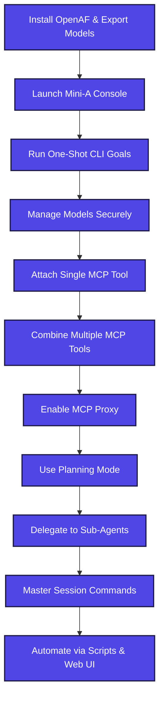
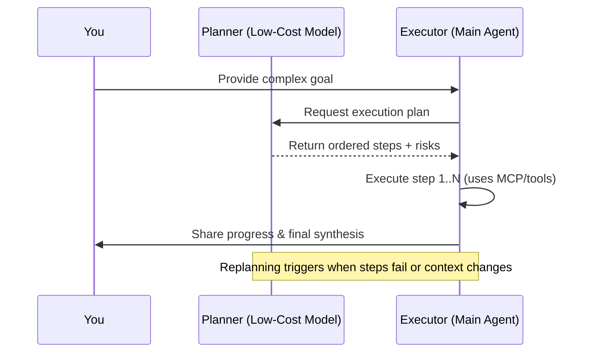
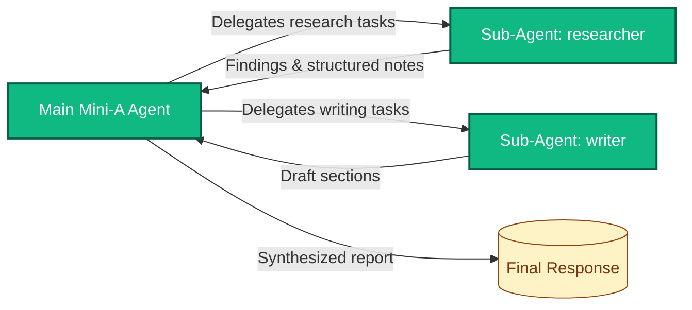

# Learning Mini-A: Step-by-Step Guide

This guide walks you from first contact with Mini-A through progressively more capable agent workflows. Each stage introduces one new concept, provides commands to try, and explains what to look for in the output. Follow the steps in order to build intuition about how Mini-A orchestrates LLM-based agents, MCP tools, and planning sub-agents.

> **Tip:** All examples assume you have [OpenAF](https://openaf.io) installed and that you can run `opack` and `ojob` from your shell.



## 1. Prerequisites & Environment Setup

1. **Install the Mini-A oPack** (skip if you cloned the repo for development):
   ```bash
   opack install mini-a
   ```
2. **Clone the repository** if you want local files/examples:
   ```bash
   git clone https://github.com/OpenAF/mini-a.git
   cd mini-a
   ```
3. **Set the primary LLM model** by exporting `OAF_MODEL`. Replace the placeholders with your vendor, model, and key:
   ```bash
   export OAF_MODEL="(type: openai, model: gpt-4o-mini, key: 'sk-...', timeout: 900000, temperature: 0.8)"
   ```
4. *(Optional)* **Set a secondary low-cost model** for dual-model optimization:
   ```bash
   export OAF_LC_MODEL="(type: openai, model: gpt-4o-mini, key: 'sk-...', temperature: 0.3)"
   ```
5. Confirm the configuration:
   ```bash
   echo $OAF_MODEL
   ```
   You should see the SLON definition echoed back. Mini-A reads both variables when launching.

## 2. Verify Mini-A Access to the Model

1. **Start the interactive console:**
   ```bash
   opack exec mini-a
   ```
2. At the prompt type a simple goal such as `Summarize the benefits of using Mini-A.`
3. The LLM should respond with a short summary. If the session fails, double-check the exported `OAF_MODEL` definition and network access.
4. Exit the console with `Ctrl+C` or by typing `/exit`.

## 3. Quick Conversations via CLI Parameters

1. Run Mini-A in one shot without entering the console:
   ```bash
   opack exec mini-a goal="List three creative team icebreakers"
   ```
2. Observe the assistant response printed to the terminal.
3. Re-run with `debug=true` to inspect the internal planning trace:
   ```bash
   opack exec mini-a goal="List three creative team icebreakers" debug=true
   ```
4. Scan the `steps` section in the debug output. You will see how the model planned the answer without external tools.

## 4. Saving & Reusing Model Definitions with Model Manager

1. Launch Mini-A in **model manager** mode to avoid exporting raw secrets:
   ```bash
   mini-a modelman=true
   ```
2. Choose **`add`** to create a new definition. Provide the type, model, and key when prompted.
3. Once saved, select **`export`** to print the `OAF_MODEL` snippet and either copy-paste it into your shell or store it in a secrets manager.
4. Exit the manager and run the console again. Mini-A will now use the stored definition when you export it.

## 5. Introducing MCP Tools (Single Tool)

Mini-A can call MCP servers for domain-specific actions. Start with one tool to learn the flow.

1. **Inspect available descriptors** under `mcps/`:
   ```bash
   ls mcps
   ```
2. **Run a goal with the Time MCP** to fetch the current time in a city:
   ```bash
   mini-a goal="What time is it in Sydney?" \
     mcp="(cmd: 'ojob mcps/mcp-time.yaml', timeout: 5000)"
   ```
3. When the answer prints, look at the debug log (add `debug=true`) to see Mini-A requesting the `getTime` tool.
4. Try a second query that requires reasoning, e.g., `goal="If it is noon in Sydney, what time is it in New York?"`. Mini-A should combine LLM reasoning with the MCP response.

## 6. Combining Multiple MCP Tools

1. Run Mini-A with **two MCP descriptors** to aggregate capabilities:
   ```bash
   mini-a goal="Gather the latest EUR/USD rate and describe what it means" \
     mcp="[(cmd: 'ojob mcps/mcp-fin.yaml'), (cmd: 'ojob mcps/mcp-time.yaml')]" \
     timeout=90000
   ```
2. Add `usetools=true` if you also want the built-in Mini Utils tool for filesystem/math operations:
   ```bash
   mini-a goal="Create a table with the current EUR/USD rate and time" \
     mcp="[(cmd: 'ojob mcps/mcp-fin.yaml'), (cmd: 'ojob mcps/mcp-time.yaml')]" \
     usetools=true
   ```
3. Watch the debug trace: Mini-A will call distinct MCP tools (`fin-getRate`, `time-getTime`) and then assemble the response.

## 7. Streamlining with the MCP Proxy

When many MCP servers are active, use the proxy feature to expose a single `proxy-dispatch` tool to the LLM, reducing token usage.

1. Enable the proxy:
   ```bash
   mini-a goal="Compare release dates for the latest Node.js and Python versions" \
     mcp="[(cmd: 'ojob mcps/mcp-time.yaml'), (cmd: 'ojob mcps/mcp-fin.yaml')]" \
     mcpproxy=true usetools=true
   ```
2. Inspect the debug output and notice only one tool (`proxy-dispatch`) appears even though multiple backends responded.
3. Read [docs/MCPPROXY-FEATURE.md](MCPPROXY-FEATURE.md) for deeper details.

## 8. Planning Mode: Autonomous Multi-Step Reasoning

Planning lets Mini-A break complex goals into multiple sub-goals executed in sequence.

1. Start a planning session:
   ```bash
   mini-a goal="Plan a one-week marketing campaign for a new product launch" planning=true
   ```
2. Observe the generated plan in the debug trace (`debug=true`). Mini-A will list steps such as `Research audience`, `Draft messaging`, `Schedule channels`.
3. Each step is solved with the base model or MCP tools before the final synthesis message is sent.
4. Experiment with `maxsteps=8` to allow more detailed plans:
   ```bash
   mini-a goal="Design a workshop agenda that includes presentations, hands-on labs, and feedback collection" \
     planning=true maxsteps=8
   ```



## 9. Sub-Agents: Delegating Specialized Tasks

You can nest Mini-A agents as **sub-agents** that handle specific phases of the plan.

1. Create a simple sub-agent configuration file (for example `examples/subagent.yaml`) based on `mini-a.yaml` but with a narrower goal or restricted tools.
2. Launch the main agent with a reference to the sub-agent via `subagent=` parameter:
   ```bash
   mini-a goal="Produce a competitive analysis brief" \
     planning=true maxsteps=6 \
     subagent="(cmd: 'ojob examples/subagent.yaml', name: 'researcher')"
   ```
3. In the debug output, look for steps delegated to `researcher`. The main agent will pass intermediate instructions, receive results, and integrate them.
4. Extend the setup by adding another sub-agent (e.g., `writer`) and compare how the plan distributes work.



## 10. Advanced Session Management

1. Use **slash commands** within the console to manage context:
   - `/show` – list all active parameters.
   - `/compact 4` – summarize older exchanges, keeping the last four steps.
   - `/summarize` – condense the full conversation into one message.
   - `/last md` – reprint the last response as raw Markdown.
2. Try a session where you iterate on a document, using `/save path/to/file.md` to capture the assistant's final answer.

## 11. Running from Scripts & Automation

1. Execute Mini-A jobs directly via `ojob` for repeatable automation:
   ```bash
   ojob mini-a.yaml goal="Draft release notes for version 2.0" useshell=false planning=true
   ```
2. Embed Mini-A in CI workflows by exporting the required `OAF_MODEL`/`OAF_LC_MODEL` variables and running the command above.
3. For web-based demos, start the UI:
   ```bash
   ./mini-a-web.sh onport=8888
   ```
   Open `http://localhost:8888`, input your goal, and observe how the same planning and tool orchestration occurs in the browser.

## 12. Troubleshooting & Next Steps

- **Authentication errors** – Re-run `mini-a modelman=true` to verify keys and model IDs.
- **Tool failures** – Execute the MCP job standalone to confirm it works, e.g., `ojob mcps/mcp-time.yaml city="Sydney"`.
- **Long-running plans** – Increase `timeout` or `maxsteps`, or add `usetime=true` to allow more execution time.
- **Cost control** – Lower `temperature`, enable `lcmodel` usage, or disable unnecessary MCP tools.

Continue exploring by reading:
- [USAGE.md](../USAGE.md) for comprehensive parameter documentation.
- [docs/OPTIMIZATIONS.md](OPTIMIZATIONS.md) for performance tuning tips.
- [docs/MCPPROXY-FEATURE.md](MCPPROXY-FEATURE.md) to learn how the MCP proxy works behind the scenes.
- [examples/](../examples/) for YAML job templates you can adapt to your own workflows.

Happy experimenting! Each stage you complete builds a deeper understanding of how Mini-A orchestrates LLM reasoning, tool use, and autonomous planning.
