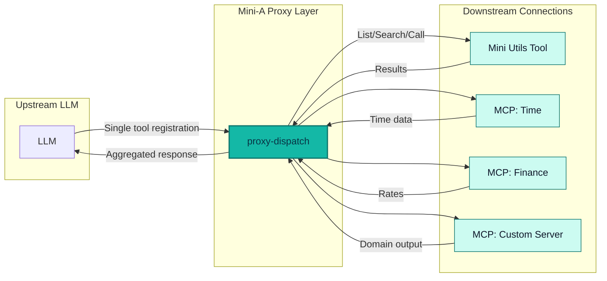

# MCP Proxy Feature

## Overview

The `mcpproxy=true` option enables aggregation of multiple MCP (Model Context Protocol) connections through a single proxy interface. This feature reduces the total context spent by exposing only one tool (`proxy-dispatch`) to the LLM instead of presenting all tools from all connections individually.



## Benefits

1. **Reduced Context Usage**: Instead of registering dozens of tools from multiple MCP servers, only a single `proxy-dispatch` tool is exposed to the LLM
2. **Simplified Tool Management**: The LLM can discover and use tools through a unified interface
3. **Better Scalability**: Add more MCP connections without overwhelming the model's context window
4. **Flexible Tool Discovery**: The `proxy-dispatch` tool supports listing, searching, and calling tools across all downstream connections
5. **Large Payload Handoff**: For large tool inputs/outputs, `proxy-dispatch` can use temporary JSON files (`argumentsFile`, `resultToFile`) to avoid inflating LLM context

## Usage

### Basic Example

```shell
mini-a goal="Your goal here" \
  usetools=true \
  mcpproxy=true \
  mcp="[(cmd: 'ojob mcps/mcp-time.yaml'), (cmd: 'ojob mcps/mcp-db.yaml')]" \
  useutils=true
```

### How It Works

When `mcpproxy=true` is set:

1. All MCP connections specified via `mcp="..."` parameter are collected
2. Connections from `useutils=true` are also included
3. All connections are initialized internally by the proxy
4. A single `proxy-dispatch` tool is registered with the LLM
5. The LLM can interact with all downstream tools through this proxy

## The proxy-dispatch Tool

The `proxy-dispatch` tool provides three actions:

### 1. List Connections and Tools

Lists all available MCP connections and their tools.

```javascript
{
  "action": "list",
  "connection": "c1",  // optional: specific connection alias
  "includeTools": true,
  "includeInputSchema": false,
  "includeAnnotations": true
}
```

### 2. Search Tools

Searches for tools by name, description, or annotations.

```javascript
{
  "action": "search",
  "query": "time",
  "connection": "c1",  // optional: limit search to specific connection
  "limit": 10
}
```

### 3. Call Tools

Calls a specific tool on a downstream MCP connection.

```javascript
{
  "action": "call",
  "tool": "get_current_time",
  "connection": "c1",  // optional: specify connection (auto-detected if unique)
  "arguments": {
    // tool-specific parameters
  }
}
```

### 4. Large Input/Output with Temporary JSON Files

Use these options when payloads are large:

- `argumentsFile` (string): load the downstream tool arguments from a JSON file path
- `resultToFile` (boolean): write downstream result JSON into a temporary file and return `resultFile` path instead of embedding the full payload in model context

```javascript
{
  "action": "call",
  "tool": "filesystemModify",
  "argumentsFile": "/tmp/mini-a-proxy-args-123.json",
  "resultToFile": true
}
```

Response shape (abridged):

```javascript
{
  "action": "call",
  "tool": "filesystemModify",
  "resultFile": "/tmp/mini-a-proxy-result-xyz.json",
  "content": [{"type":"text","text":"Result written to temporary JSON file: ..."}]
}
```

Temporary files are marked for auto-delete on process shutdown and cleaned by Mini-A shutdown hooks.

## Implementation Details

### Key Components

1. **`_createMcpProxyConfig(mcpConfigs, args)`**: Creates a dummy MCP configuration that wraps all downstream connections
2. **Proxy State Management**: Uses `global.__mcpProxyState__` to track all connections, tools, and aliases
3. **Helper Functions**: Includes utilities for deep cloning, sanitizing sensitive data, resolving connection IDs, and rebuilding tool indexes

### Connection Tracking

Each MCP connection is assigned:
- A unique ID (MD5 hash of the configuration)
- An alias (e.g., "c1", "c2", "c3")
- Tool catalog with full metadata
- Server information and last refresh timestamp

### Integration Points

The proxy integrates seamlessly with existing mini-a features:
- Works with `usetools=true` for native model tool registration
- Compatible with `useutils=true` to include file utilities
- Supports all MCP connection types (stdio, remote, dummy, etc.)

## Example Scenarios

### Scenario 1: Multiple MCP Servers

```bash
mini-a goal="Get the current time and query the database" \
  usetools=true \
  mcpproxy=true \
  mcp="[(cmd: 'ojob mcps/mcp-time.yaml'), (cmd: 'ojob mcps/mcp-db.yaml jdbc=jdbc:h2:./data')]"
```

The LLM sees only `proxy-dispatch` and learns to:
1. List available tools: `{"action":"list"}`
2. Search for time-related tools: `{"action":"search","query":"time"}`
3. Call the tool: `{"action":"call","tool":"get_current_time","arguments":{}}`

### Scenario 2: With File Utilities

```bash
mini-a goal="Read a file and get the current time" \
  usetools=true \
  mcpproxy=true \
  mcp="[(cmd: 'ojob mcps/mcp-time.yaml')]" \
  useutils=true
```

Both the time MCP and file utilities are aggregated through the proxy.

## Comparison: With vs Without Proxy

### Without mcpproxy

```
Tools registered with LLM:
- get_current_time
- get_timezone
- format_datetime
- init (from useutils)
- filesystemQuery (from useutils)
- filesystemModify (from useutils)
Total: 6 tools + their schemas = Large context
```

### With mcpproxy=true

```
Tools registered with LLM:
- proxy-dispatch
Total: 1 tool + its schema = Minimal context
```

## Context Savings Guidance

Using temporary JSON handoff can materially reduce context usage when tool payloads are large. A rough estimate is **~4 characters per token** for JSON-heavy content.

- 20 KB JSON inline payload ≈ 5,000 tokens
- 100 KB JSON inline payload ≈ 25,000 tokens
- 500 KB JSON inline payload ≈ 125,000 tokens

When `resultToFile=true`, the model receives only a short status string + file path (typically a few dozen tokens) instead of the full JSON blob.

### When this is most helpful

- Large `filesystemQuery`/`filesystemModify` results (especially with many files or rich metadata)
- SQL/API MCP tools that return large arrays
- Multi-step pipelines where one tool output becomes another tool input
- Summarization/extraction flows where only a small subset of fields is needed

### Recommended usage incentives

Prefer this pattern when all of the following are true:

1. Payload is expected to be large (hundreds of lines / tens of KB+)
2. You have a safe way to inspect/extract from files: 
   - `useutils=true` (recommended), or
   - `useshell=true readwrite=true`
3. The next step only needs selected fields rather than the full raw payload in context

For small payloads, inline `arguments` and inline `result` are simpler and usually better.

## Technical Notes

1. **Global State**: The proxy maintains global state in `global.__mcpProxyState__` and `global.__mcpProxyHelpers__`
2. **Lazy Initialization**: Compatible with `mcplazy=true` for deferred connection setup
3. **Error Handling**: Each connection tracks errors independently; failures don't break the entire proxy
4. **Tool Caching**: Works with existing tool caching mechanisms (when `toolcachettl` is set)
5. **Security**: Sensitive credentials in connection descriptors are sanitized before being returned

## Based On

This implementation is based on the standalone `mcps/mcp-proxy.yaml` oJob file, which provides the same proxy functionality as a standalone MCP server. The integration into mini-a.js makes this capability available natively without requiring external processes.
