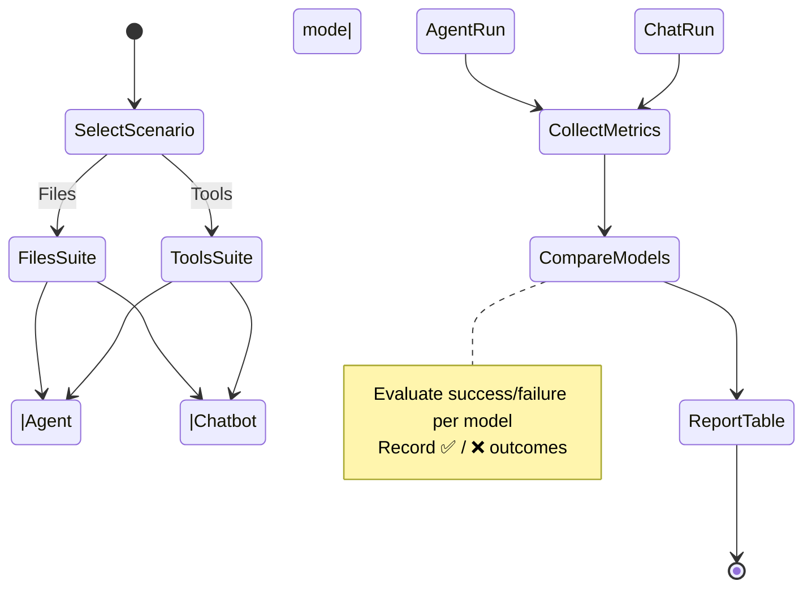

# Tests

This document provides detailed test results showing how popular language models behave when Mini-A runs through two repeatable scenarios:

- **"Files"** – strictly shell-based operations that inspect the repository layout.
- **"Tools"** – MCP-backed tasks that probe the network utility descriptors.



We execute both suites in agent and chatbot mode to highlight differences in planning-heavy runs versus conversational shortcuts. Smaller or older models often miss steps, produce malformed tool payloads, or time out when juggling multi-step reasoning, which is why you see more ❌ entries compared to larger, more recent releases. Newer frontier models typically offer stronger tool grounding, higher context windows, and better adherence to the agent protocol, so they pass the same flows consistently.

## "Files" test

Using just shell commands without any tooling APIs both in agent and chatbot mode.

### Results

| Model      | Files md | Files oafp | Files chat | Files oafp chat | 
|------------|----------|------------|------------|-----------------|
| gpt-5-nano | ✅       | ✅         | ✅         | ✅              |
| gpt-5-mini | ✅       | ✅         | ✅         | ✅              |
| gpt-5      | ✅       | ✅         | ✅         | ✅              |
| claude-haiku-3 | ✅ | ✅ | ❌ | ✅ |    
| claude-haiku-4.5 | ✅ | ✅ | ❌ | ✅ |
| claude-sonnet-4.5 | ✅ | ✅ | ✅ | ✅ |  
| gemini-3-pro | ✅ | ✅ | ❌ | ❌ |
| openai/gpt-oss-20b | ✅ | ✅ | ❌ | ❌ |
| openai/gpt-oss-120b | ✅ | ✅ | ✅ | ❌ |
| llama-3.1-8b | ❌ | ❌ | ❌ | ❌ |
| amazon nova pro | ✅ | ✅ | ❌ | ❌ |
| amazon nova micro | ❌ | ❌ | ❌ | ❌ |

Consistent ✅ rows indicate the model can gather filesystem context, summarize it in Markdown, and adapt the answer to both agent-style and chatbot prompts without deviating from the requested format.

### Tests

| Test | Command |
|------|---------|
| **files md**   | ```mini-a goal="list the filenames in the current folder" useshell=true format=md``` |
| **files oafp** | ```oafp in=minia data="(goal: 'list the filenames in the current folder', useshell: true)" out=ctree``` |
| **files chat** | ```mini-a goal="list the filenames in the current folder" useshell=true format=md chatbotmode=true``` |
| **files oafp chat** | ```oafp in=minia data="(goal: 'list the filenames in the current folder', useshell: true, chatbotmode: true)" out=ctree``` |

## "Tools" tests

### Results

| Model      | Emb tool | API tool | Emb tool chat | API tool chat |
|------------|----------|----------|---------------|---------------|
| gpt-5-nano | ✅       | ✅         | ❌         | ✅            |
| gpt-5-mini | ✅ | ✅ | ✅ | ✅ |
| gpt-5      | ✅ | ✅ | ✅ | ✅ |
| claude-3-haiku | ✅ | ❌ | ✅ | ✅ |
| claude-haiku-4.5 | ✅ | ✅ | ❌ | ❌ |
| claude-sonnet-4.5 | ✅ | ✅ | ✅ | ✅ |   
| gemini-3-pro | ✅ | ✅ | ❌ | ❌ |
| openai/gpt-oss-20b | ✅ | ✅ | ❌ | ✅ |
| openai/gpt-oss-120b | ✅ | ✅ | ❌ | ❌ |
| amazon nova pro   | ✅ | ❌ | ❌ | ❌ |
| amazon nova micro | ❌ | ❌ | ❌ | ❌ |

Tool-centric flows stress whether a model can interpret MCP tool schemas, wait for execution results, and weave them into the final answer. Larger models tend to excel at the structured request/response patterns, while smaller models often hallucinate parameters or ignore the results entirely.

### Tests

| Test | Command |
|------|---------|
| **Emb tool** | ```mini-a goal="what is the port 443 latency for host yahoo.co.jp" mcp="(cmd: 'ojob mcps/mcp-net.yaml')" format=md``` |
| **API tool** | ```mini-a goal="what is the port 443 latency for host yahoo.co.jp" mcp="(cmd: 'ojob mcps/mcp-net.yaml')" format=md usetools=true``` |
| **Emb tool chat** | ```mini-a goal="what is the port 443 latency for host yahoo.co.jp" mcp="(cmd: 'ojob mcps/mcp-net.yaml')" chatbotmode=true format=md``` |
| **API tool chat** | ```mini-a goal="what is the port 443 latency for host yahoo.co.jp" mcp="(cmd: 'ojob mcps/mcp-net.yaml')" format=md chatbotmode=true usetools=true``` |
