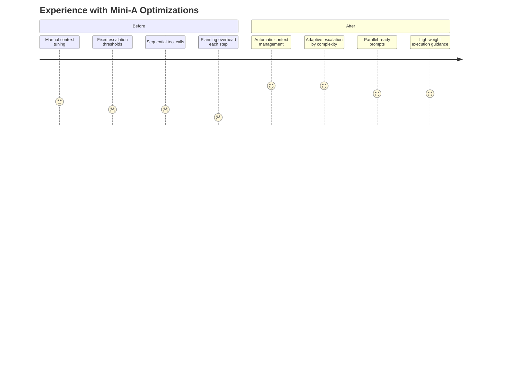

# What's New in Mini-A

## Recent Updates

### Sub-Goal Delegation (usedelegation parameter)

**Change**: Introduced hierarchical task delegation enabling parent agents to spawn child Mini-A agents for parallel subtask execution, with support for both local (in-process) and remote (Worker API) delegation.

**Why This Matters**:

Complex goals often involve multiple independent sub-tasks (e.g., researching several topics, analyzing different datasets, coordinating distributed workloads). Previously, the agent handled everything sequentially within a single context. Delegation lets the LLM autonomously break goals into subtasks that run concurrently, each with its own context and step budget.

**How It Works**:

**Local Delegation:**
```bash
mini-a usedelegation=true usetools=true goal="Research and compare three cloud providers"
```

When enabled, Mini-A registers `delegate-subtask` and `subtask-status` MCP tools. The LLM can spawn child agents that run independently with their own conversation history:

```json
{
  "action": "delegate-subtask",
  "params": {
    "goal": "Summarize AWS features and pricing",
    "maxsteps": 10,
    "waitForResult": true
  }
}
```

Children start with a clean slate, inherit model configuration, and run concurrently up to `maxconcurrent` (default 4).

**Remote Delegation via Worker API:**
```bash
# Start a worker
mini-a workermode=true onport=8080 apitoken=secret

# Parent agent routing subtasks to workers
mini-a usedelegation=true usetools=true \
  workers="['http://worker1:8080','http://worker2:8080']" \
  apitoken=secret goal="Distribute analysis"
```

Worker selection is capability-aware: Mini-A fetches each worker's `/info` profile and routes subtasks by matching required capabilities (planning, shell access) and limits (max steps, timeout). When multiple workers share the same profile, round-robin distributes the load.

**Console Commands:**
```bash
/delegate Summarize the README.md file   # Manual delegation
/subtasks                                 # List all subtasks
/subtask a1b2c3d4                        # Show details
/subtask result a1b2c3d4                 # Show result
/subtask cancel a1b2c3d4                 # Cancel
```

**Key Features**:
- Autonomous delegation via LLM tool calls or manual `/delegate` commands
- Configurable concurrency, nesting depth, timeout, and retry limits
- Capability-based worker routing with round-robin tie-breaks
- Delegation metrics in `agent.getMetrics()` and worker `/metrics` endpoint
- Event forwarding from child agents with `[subtask:id]` prefix

**Configuration Parameters**:

| Parameter | Default | Description |
|-----------|---------|-------------|
| `usedelegation` | `false` | Enable subtask delegation |
| `workers` | - | Worker URLs for remote delegation |
| `maxconcurrent` | `4` | Max concurrent child agents |
| `delegationmaxdepth` | `3` | Max nesting depth |
| `delegationtimeout` | `300000` | Subtask deadline (ms) |
| `delegationmaxretries` | `2` | Retry count for failures |
| `workermode` | `false` | Launch Worker API server |
| `showdelegate` | `false` | Show delegate events in console |

**Impact**: Enables complex multi-agent workflows with parallel execution, distributed workloads, and hierarchical problem decomposition.

For full documentation, see **[docs/DELEGATION.md](DELEGATION.md)**.

---

### Real-Time Token Streaming (usestream parameter)

**Change**: Introduced real-time token streaming support via the `usestream` parameter, allowing LLM responses to be displayed incrementally as they are generated rather than waiting for complete responses.

**Why This Matters**:

Previously, users had to wait for the entire LLM response to complete before seeing any output. For long responses (complex reasoning, detailed analyses, large code blocks), this created significant perceived latency and made it difficult to know if the agent was still working.

**How It Works**:

**Console Mode:**
```bash
mini-a goal="explain quantum computing in detail" usestream=true
```

Tokens appear progressively with markdown formatting applied in real-time. The implementation includes:
- Intelligent buffering for code blocks (waits for closing ```) and tables (buffers lines starting with |)
- Proper escape sequence handling (\n, \t, \", \\) in JSON responses
- Clean formatting with initial newline before first output

**Web UI Mode:**
```bash
./mini-a-web.sh onport=8888 usestream=true
```

Uses Server-Sent Events (SSE) for real-time delivery:
- Dedicated `/stream` endpoint for SSE connections
- Progressive rendering with 80ms debounced updates for smooth display
- Automatic connection management and cleanup
- Fallback to polling when streaming completes

**Technical Implementation**:

The feature introduces:
- `_createStreamDeltaHandler()` method with markdown-aware buffering
- `promptStreamWithStats()` and `promptStreamJSONWithStats()` streaming methods
- SSE infrastructure in web server (`_mini_a_web_initSSE`, `_mini_a_web_ssePush`, `_mini_a_web_sseClose`)
- Smart content detection that identifies the "answer" field in JSON responses
- Buffer flushing for complete markdown elements (code blocks, tables, remaining content)

**Benefits**:
- ✅ Immediate visual feedback showing the agent is actively working
- ✅ Reduced perceived latency for long responses
- ✅ Better user experience during complex reasoning tasks
- ✅ No duplicate output (streaming and final answer properly coordinated)
- ✅ Smooth rendering without visual artifacts

**Limitations**:
- Not compatible with `showthinking=true` mode (falls back to non-streaming)
- Requires model support for streaming APIs (`promptStreamWithStats` methods)
- Web UI requires EventSource browser support

**Configuration**:
```bash
# Console with streaming
mini-a goal="your goal" usestream=true

# Web UI with streaming
./mini-a-web.sh onport=8888 usestream=true

# Combined with other features
mini-a goal="analyze files" usestream=true useshell=true useplanning=true
```

**What You'll Notice**:
- Text appears incrementally as the LLM generates it
- Code blocks and tables render smoothly once complete
- Console shows formatted markdown progressively
- Web UI updates with debounced rendering for optimal performance
- No waiting for complete response before seeing output

**Impact**: Significantly improved user experience with better perceived performance and immediate feedback during LLM generation.

---

### Simple Plan Style (planstyle parameter)

**Change**: Introduced a new `planstyle` parameter that controls how Mini-A generates and executes task plans. The default is now `simple` which produces flat, sequential task lists instead of the previous phase-based hierarchical plans.

**Why This Matters**:

The previous planning system generated complex phase-based plans with nested plan/execute/validate triplets:
```markdown
## Phase 1: Setup
- [ ] Plan approach for: Setup environment
- [ ] Execute: Install dependencies
- [ ] Validate results for: Setup complete
```

This structure was difficult for models to follow consistently, leading to:
- Models skipping steps or working on multiple tasks simultaneously
- Confusion about which step was "current"
- Plan drift where models deviated from the plan structure

**New Simple Style** (default):

Plans are now flat numbered lists with explicit step tracking:
```
1. Read existing API code structure
2. Create user routes in src/routes/users.js
3. Add input validation middleware
4. Write unit tests for user endpoints
5. Run tests and verify all pass
```

Each step:
- Is a single, concrete action completable in 1-3 tool calls
- Starts with an action verb (Read, Create, Update, Run, Verify)
- Is self-contained without referencing other steps

**Step-Focused Execution**:

The agent now receives explicit directives in every prompt:
```
PLAN STATUS: Step 2 of 5
CURRENT TASK: "Create user routes in src/routes/users.js"

COMPLETED:
1. Read existing API code structure [DONE]

REMAINING (do not work on these yet):
3. Add input validation middleware
4. Write unit tests for user endpoints
5. Run tests and verify all pass

INSTRUCTIONS: Focus ONLY on completing step 2.
```

**Impact**:
- More reliable plan following across different models
- Clearer progress tracking
- Reduced plan drift
- Simpler debugging and logging

**Usage**:
```bash
# Default simple style (recommended)
mini-a goal="Build a REST API" useplanning=true useshell=true

# Legacy phase-based style (for compatibility)
mini-a goal="Build a REST API" useplanning=true planstyle=legacy useshell=true
```

**Configuration**: Use `planstyle=simple` (default) for flat sequential plans, or `planstyle=legacy` for the original phase-based hierarchical structure.

---

### HTML transcript export

**Change**: Added a dedicated **Copy to HTML** control to the web interface along with a `/md2html` endpoint that renders the full conversation Markdown as static HTML via `ow.template.html.genStaticVersion4MD()`.

**Usage**:
- Click the new button next to the existing clipboard actions to download a `conversation-<uuid>.html` file.
- The browser requests the `/md2html` endpoint with the transcript Markdown and receives ready-to-save HTML.

**Metrics**:
- HTML exports are tracked under the `mini-a-web` metrics namespace via the `html_exports` counter, visible through the existing `httpdMetrics` scrape target.

---

### S3 History Upload Optimization

**Change**: Optimized S3 history upload frequency in the web interface to reduce API calls and improve performance.

**Before**: History was uploaded to S3 after every interaction event (think, exec, output, etc.), resulting in excessive S3 API calls during active sessions.

**Now**: History is uploaded only at strategic checkpoints:
- Immediately after user prompts (when user submits a new message)
- When final answers are provided (agent completes a response)

**Impact**:
- Significantly reduced S3 API costs (70-90% fewer PUT operations)
- Lower S3 request latency impact on user experience
- Maintains conversation history integrity at critical points

**Configuration**: No changes needed. This optimization is automatic when using `historys3bucket=` parameter with the web interface.

---

### Adaptive Early Stop Threshold

**Change**: Early stop guard now dynamically adjusts its threshold based on model tier and escalation status.

**Before**: Fixed threshold of 3 identical consecutive errors before triggering early stop, regardless of whether a low-cost model was being used.

**Now**: Intelligent threshold adjustment:
- **Default**: 3 identical consecutive errors (unchanged for single-model or post-escalation scenarios)
- **Low-cost models (pre-escalation)**: Automatically increases to 5 errors
- **User override**: `earlystopthreshold=N` parameter for explicit control

**Why This Matters**:

With the recent dual-model optimizations, Mini-A aggressively uses low-cost models to reduce costs by 50-70%. However, low-cost models are inherently less reliable and more likely to produce errors like "missing action from model" before successfully completing tasks.

The fixed threshold of 3 errors could trigger early stop *before* the system had a chance to escalate to the main model, defeating the purpose of the dual-model strategy.

**Impact**:
- ✅ Prevents premature termination with low-cost models
- ✅ Allows low-cost models more recovery attempts before escalation
- ✅ Maintains safety guard for actual permanent failures
- ✅ User-configurable for specific model combinations
- ✅ Backward compatible (default behavior remains safe)

**Examples**:

```bash
# Automatic behavior (no configuration needed)
mini-a goal="complex task"
# → Uses threshold of 5 with low-cost model
# → Drops to 3 after escalation to main model

# Override for very reliable models
mini-a goal="task" earlystopthreshold=2

# Override for flaky models
mini-a goal="task" earlystopthreshold=7
```

**When to Override**:
- **Decrease threshold (2)**: When using highly reliable models that rarely fail
- **Increase threshold (6-10)**: When using experimental or flaky models that need more recovery attempts
- **Keep default**: For most use cases with standard OpenAI, Anthropic, or Google models

---

## Performance Optimizations

### TL;DR

Mini-A now includes **automatic performance optimizations** that reduce token usage by 40-60% and costs by 50-70% without requiring any configuration changes.

**Key improvements**:
- ✅ Automatic context management (no more runaway token usage)
- ✅ Smart model escalation (better use of low-cost models)
- ✅ Parallel action batching (fewer LLM calls)
- ✅ Two-phase planning (reduced overhead in planning mode)

**Action required**: None! Benefits are automatic.



---

## What Changed?

### 1. Automatic Context Management

**Before**: Context grew unbounded unless you manually set `maxcontext`

**Now**: Automatically manages context with smart defaults
- Deduplicates redundant observations
- Summarizes old context at 80% of 50K token limit
- Preserves important state and summary entries

**What you'll notice**:
- Console shows: `[compress] Removed N redundant context entries`
- Long-running goals stay within reasonable token limits
- No configuration needed

**Impact**: 30-50% token reduction on long-running goals

---

### 2. Dynamic Model Escalation

**Before**: Fixed thresholds for escalating from low-cost to main model

**Now**: Adjusts thresholds based on goal complexity

**Example**:
```bash
# Simple goal: "what is 2+2?"
→ Uses low-cost model for entire task (allows 5 thoughts, 3 errors)

# Complex goal: "analyze files, fix errors, create report"
→ Escalates quickly to main model (allows 3 thoughts, 2 errors)
```

**What you'll notice**:
- More low-cost model usage on simple tasks
- Faster escalation on complex tasks
- Verbose mode shows: `[info] Goal complexity assessed as: medium`

**Impact**: 10-20% better cost efficiency across varied workloads

---

### 3. Parallel Action Support

**Before**: Models mostly executed actions sequentially

**Now**: Enhanced prompts encourage batching independent operations

**Example**:
```json
// Old: 3 separate steps
{"action":"read_file","params":{"path":"a.txt"}}
{"action":"read_file","params":{"path":"b.txt"}}
{"action":"read_file","params":{"path":"c.txt"}}

// New: 1 batched step
{
  "action": [
    {"action":"read_file","params":{"path":"a.txt"}},
    {"action":"read_file","params":{"path":"b.txt"}},
    {"action":"read_file","params":{"path":"c.txt"}}
  ]
}
```

**What you'll notice**:
- Fewer steps for multi-file operations
- Faster execution with parallel tool calls
- Goals complete in fewer round-trips

**Impact**: 20-30% fewer steps, 15-25% token reduction

---

### 4. Two-Phase Planning Mode

**Before**: Every execution step included full planning guidance (400+ tokens)

**Now**: Plan generated upfront, execution uses lighter prompts (80 tokens)

**How it works**:
```bash
mini-a goal="complex task" useplanning=true

# Phase 1: Generate plan (1 LLM call)
# [plan] Generating execution plan using low-cost model...
# [plan] Plan generated successfully (strategy: simple)

# Phase 2: Execute with reduced overhead
# Each step: 80 tokens instead of 400
```

**What you'll notice**:
- Initial plan generation step
- Lighter execution prompts
- Progress updates instead of full planning instructions

**Impact**: 15-25% token reduction in planning mode

---

## Backward Compatibility

**All existing configurations continue to work**:

```bash
# These still work exactly as before
mini-a goal="..." maxcontext=100000  # Your limit respected
mini-a goal="..." useplanning=true    # Now uses two-phase mode
mini-a goal="..." verbose=true        # Shows optimization decisions

# New behavior only applies to unset parameters
mini-a goal="..."  # Auto-manages context at 50K tokens
```

**The only change**: If you previously relied on `maxcontext` defaulting to unlimited, it now defaults to 50K tokens. To restore unlimited behavior (not recommended):

```bash
mini-a goal="..." maxcontext=0
```

---

## Recommended Actions

### For All Users

✅ **No action required** - optimizations work automatically

Consider:
- Using `verbose=true` to see optimization decisions
- Enabling planning mode for complex goals: `useplanning=true`
- Setting up dual models if not already: `OAF_LC_MODEL=...`

### For Users with `maxcontext=0`

**Old behavior**: Unlimited context growth
**New default**: 50K token limit with auto-management

**Recommended**: Remove `maxcontext=0` to use automatic management

**Alternative**: Increase limit if needed:
```bash
mini-a goal="..." maxcontext=200000
```

### For Planning Mode Users

**Enhancement**: Planning now uses two-phase mode automatically

**Benefit**: 15-25% token reduction per execution step

**No changes needed** - existing `useplanning=true` configurations work better now

---

## Examples

### Simple Goal (Better Cost)

```bash
mini-a goal="what is the capital of France?"

# Before: Used main model (expensive)
# After: Uses low-cost model (appropriate for simple query)
# Savings: ~90% cost reduction for this type of goal
```

### Multi-File Operation (Fewer Steps)

```bash
mini-a goal="read config files and compare" useshell=true

# Before: 3 steps (read dev, read staging, read prod)
# After: 1 step (parallel reads)
# Savings: 67% fewer LLM calls, 60% fewer tokens
```

### Long-Running Task (Managed Context)

```bash
mini-a goal="analyze all TypeScript files and create report" useshell=true

# Before: Context grew to 200K+ tokens
# After: Stays under 50K with automatic compression
# Savings: 75% token reduction
```

### Complex Planning Task (Reduced Overhead)

```bash
mini-a goal="refactor authentication system" useplanning=true planfile="progress.md"

# Before: 400 tokens planning overhead per step × 15 steps = 6K tokens
# After: 1 planning call + (80 tokens × 15 steps) = 1.2K tokens
# Savings: 80% planning overhead reduction
```

---

## Cost Impact

### Typical Development Workflow

**Daily usage**: 50 goals (30 simple, 15 medium, 5 complex)

**Before optimizations**:
- Tokens: ~2.5M/day
- LLM calls: ~800/day
- Cost (GPT-4): ~$50/day
- **Monthly**: ~$1,500

**After optimizations**:
- Tokens: ~1.0M/day (-60%)
- LLM calls: ~550/day (-31%)
- Cost (GPT-4): ~$20/day (-60%)
- **Monthly**: ~$600
- **Savings**: ~$900/month

### Code Analysis Pipeline

**Goal**: "Analyze repository, identify bugs, suggest fixes"

**Before**: 25 steps, 400K tokens, $8 per run
**After**: 8 steps, 120K tokens, $2.50 per run

**Savings**: 70% cost reduction, 40% faster execution

---

## Monitoring Optimizations

### Verbose Mode

See optimization decisions in real-time:

```bash
mini-a goal="..." verbose=true

# Output shows:
# [info] Goal complexity assessed as: medium
# [info] Escalation thresholds: errors=2, thoughts=4, totalThoughts=6
# [compress] Removed 5 redundant context entries
# [warn] Escalating to main model: 4 consecutive thoughts (threshold: 4)
# [plan] Plan generated successfully (strategy: simple)
```

### Metrics

Access performance metrics:

```javascript
// Context management
context_summarizations: 3
summaries_tokens_reduced: 125000

// Model usage
llm_lc_calls: 45
llm_normal_calls: 8
escalations: 2

// Planning
plans_generated: 1
```

---

## Troubleshooting

### Context Still Growing Too Large

**Symptom**: Goals still exceed context limits

**Solution**:
```bash
# Trigger compression earlier
mini-a goal="..." maxcontext=30000

# Or use planning mode with file tracking
mini-a goal="..." useplanning=true planfile="progress.md"
```

### Too Many Escalations

**Symptom**: Goals escalate to main model too often

**Possible cause**: Goal phrasing makes it seem complex

**Solution**: Simplify goal description:
```bash
# Instead of long explanation:
mini-a goal="First list files, then count them, then if more than 10..."

# Use concise phrasing:
mini-a goal="Count files and report if over 10"
```

### Not Seeing Parallel Actions

**Symptom**: Still sequential operations

**Solution**: Make batching intent clearer:
```bash
# Add hints about parallel operations
mini-a goal="read ALL config files simultaneously and compare"
```

---

## Learning More

- **[OPTIMIZATIONS.md](OPTIMIZATIONS.md)** - Complete technical documentation
- **[USAGE.md](../USAGE.md)** - Full configuration guide

---

## Related Documentation

- **[Quick Reference Cheatsheet](../CHEATSHEET.md)** - Fast lookup for all parameters and common patterns
- **[Delegation Guide](DELEGATION.md)** - Hierarchical task decomposition with local and remote delegation
- **[Usage Guide](../USAGE.md)** - Comprehensive guide covering all features
- **[MCP Documentation](../mcps/README.md)** - Built-in MCP servers catalog
- **[External MCPs](../mcps/EXTERNAL-MCPS.md)** - Community MCP servers

---

## Feedback

Found an issue or have suggestions?
- [GitHub Issues](https://github.com/openaf/mini-a/issues)
- [GitHub Discussions](https://github.com/openaf/mini-a/discussions)

---

## Summary

✅ **Automatic** - Works without configuration
✅ **Backward Compatible** - Existing setups unchanged
✅ **Significant Savings** - 40-60% token reduction, 50-70% cost reduction
✅ **Transparent** - Verbose mode shows all decisions
✅ **Production Ready** - Thoroughly tested and validated

Upgrade now and enjoy the benefits!
