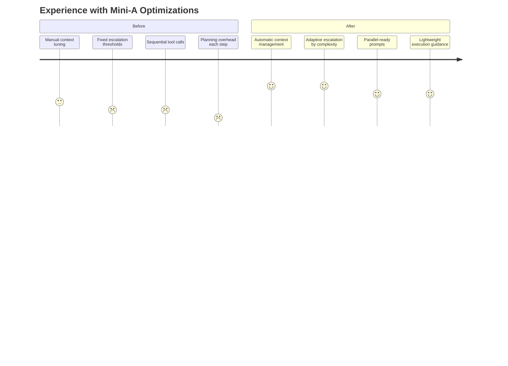

# What's New in Mini-A

## Recent Updates

### `/rewind` — Undo Last Exchanges

**Change**: New `/rewind [n]` slash command that removes the last `n` user+assistant exchanges from the conversation history (default n=1), mirroring the same feature in Claude Code.

- Works exactly like `/compact` for persistence: updates both the in-memory conversation (`setConversation`) and the on-disk JSON file
- **Delegation-aware**: any pending or running subtasks are automatically cancelled with reason "Rewound by /rewind" when rewound; cancelled IDs are listed in the output
- Token feedback: prints before/after estimated token counts so the user sees how much context was freed
- Graceful edge cases: "No conversation to rewind." when history is empty; clamps `n` to the number of available user messages; clears `lastGoalPrompt`/`lastResult` when rewinding to an empty conversation

**Usage:**

```bash
/rewind          # undo the last exchange
/rewind 3        # undo the last 3 exchanges
```

---

### Forked Sub-agents, Auto-delegation & Startup Scouts

**Change**: The delegation system gains three major new capabilities that extend the existing `usedelegation` + `delegate-subtask` infrastructure without replacing it.

#### Forked Sub-agents (`fork=true`)

Child agents can now inherit a snapshot of the parent's context instead of starting from scratch.

- **`fork: true`** on `delegate-subtask` (or `/delegate fork <goal>` in the console) creates a forked sub-agent
- **`forkscope`** controls what is inherited: `["memory"]` (working memory, default) and/or `["context"]` (last 50 conversation history entries)
- The snapshot is passed via the existing `args.state` deserialization path — no separate code paths
- For remote workers, the state is serialized and transmitted inline in the task payload; `forkstatemaxbytes` (default 64 KB) caps the payload, dropping oldest history entries first if oversized
- Fork scope defaults vary by trigger: `["memory","context"]` for `/delegate fork`, `["memory"]` for LLM-driven and CLI tasks

#### Auto-delegation (`autodelegation=true`)

Tool results that are too large for the parent's context window are automatically summarized by a short-lived sub-agent.

- Enabled with `autodelegation=true` + `usedelegation=true`
- Triggered when a tool result's byte size ≥ `autodelegationthreshold` (default 8192) **or** the tool name is in `noisytools=`
- The summarization sub-agent receives the raw output (up to 32 KB) and the parent goal; it returns 2–5 sentences of key facts
- **Automatic fork decision**: the sub-agent is forked (inherits working memory) only when `usememory=true` and the parent's working memory is non-empty — otherwise it runs clean, avoiding serialization overhead for empty state
- The parent context records `[OBS …] [auto-delegated summary] …` instead of the raw blob
- Recursion is prevented: all child agents receive `_autoDelegate=false` so they never cascade
- Per-step cap via `autodelegationmaxperstep` (default 2) limits runaway delegation on steps with many tool calls
- New metric: `autodelegation_triggered`

#### Pre-specified Startup Scouts (`subtasks=` / `subtasksfile=`)

Sub-agent goals can be registered at startup and run in parallel with (or before) the main loop.

- `subtasks='goal1|goal2|goal3'` — pipe-separated goals; submitted before the main loop
- `subtasksfile=path.yaml` — YAML/JSON array of `{goal, fork, args, timeout}` objects
- Parallel by default (all scouts run concurrently); `subtaskssequential=true` serializes them and blocks until all complete before the main loop starts
- Results are harvested into parent working memory as `artifacts` when the main agent finishes
- New metrics: `startup_subtasks_submitted`, `startup_subtasks_completed`, `startup_subtasks_failed`

**New parameters:**

| Parameter | Default | Description |
|-----------|---------|-------------|
| `autodelegation` | `false` | Enable auto-delegation for noisy tool results |
| `autodelegationthreshold` | `8192` | Byte threshold that triggers auto-delegation |
| `autodelegationmaxperstep` | `2` | Max auto-delegations per step |
| `noisytools` | `""` | Comma-separated tool names always auto-delegated |
| `subtasks` | `""` | Pipe-separated startup scout goals |
| `subtasksfile` | `""` | Path to YAML/JSON file of startup task objects |
| `subtaskssequential` | `false` | Run scouts/all subtasks one at a time |
| `forkstatemaxbytes` | `65536` | Max bytes of fork state sent to remote workers |

**Updated `delegate-subtask` tool parameters:**

| Parameter | Default | Description |
|-----------|---------|-------------|
| `fork` | `false` | Spawn a forked sub-agent with parent context |
| `forkscope` | `["memory"]` | What to inherit: `"memory"` and/or `"context"` |

**Updated console commands:**

- `/delegate fork <goal>` — spawns a forked sub-agent with `["memory","context"]` scope
- `/subtasks` — now shows `[fork]` badge on forked subtasks

See [docs/DELEGATION.md](DELEGATION.md) for full documentation including examples and the remote-worker protocol extension.

---

### Wiki Knowledge Base (`usewiki`)

**Change**: Mini-A now supports a persistent, shared Markdown wiki following Andrej Karpathy's LLM Wiki pattern — agents distil knowledge into structured pages and retrieve it across sessions.

**What's New**:

- **`MiniAWikiManager`** class (`mini-a-wiki.js`): pluggable FS and S3 backends, `parseFrontmatter`, `extractLinks`, `search`, `lint`, and `write` operations.

- **New `wiki` agent action**: the agent can call `list`, `read`, `search`, `lint`, or `write` (when `wikiaccess=rw`) at any step:
  ```json
  { "action": "wiki", "params": { "op": "search", "query": "authentication decision" } }
  ```

- **Lint checks**: `broken_link` (error), `missing_frontmatter` (warning), `heading_hierarchy` (warning), `orphan` (warning), `near_duplicate` (info), `stale` (info), `memory_conflict` (warning).

- **Auto-bootstrapping**: when a new empty wiki is opened in `rw` mode, Mini-A creates both `AGENTS.md` and `index.md`. `AGENTS.md` contains the ingestion workflow and contribution rules; `index.md` is the wiki entrypoint and starter table of contents.

- **Console commands**: `/wiki list`, `/wiki read <page>`, `/wiki search <query>`, `/wiki lint`.

- **`/stats wiki`**: new stats mode showing per-op counters and error counts for the current session.

- **MiniUtilsTool** `wiki` method: available as an MCP tool when `useutils=true`.

**New parameters**:

| Parameter | Default | Description |
|-----------|---------|-------------|
| `usewiki` | `false` | Enable wiki knowledge base |
| `wikiaccess` | `ro` | `ro` or `rw` |
| `wikibackend` | `fs` | `fs`, `s3`, `s3fs`, or `es` |
| `wikiroot` | `.` | Root directory (FS backend) |
| `wikibucket` | — | S3 bucket (`s3`/`s3fs`) |
| `wikiprefix` | — | S3 key prefix (`s3`/`s3fs`) or Elasticsearch index (`es`) |
| `wikiurl` | — | S3 endpoint URL or Elasticsearch/OpenSearch base URL (`esurl` internally) |
| `wikiaccesskey` | — | S3 access key or Elasticsearch username |
| `wikisecret` | — | S3 secret key or Elasticsearch password |
| `wikiregion` | — | S3 region |
| `wikiuseversion1` | `false` | S3 path-style signing |
| `wikiignorecertcheck` | `false` | Skip TLS cert check |
| `wikilintstaleddays` | `90` | Stale threshold for lint |

**Protected Pages**: `AGENTS.md` is protected and cannot be deleted via the `delete` operation. Attempting to delete it returns an error: `"cannot delete AGENTS.md (protected)"`. This ensures the wiki's ingestion workflow and contribution rules always remain accessible.

**When to use `usewiki` vs `usememory`**:

- **`usememory=true`** — tracks in-flight reasoning (facts, decisions, evidence) for the current agent; scoped to one session or one user's global store.
- **`usewiki=true`** — encyclopaedic knowledge shared across all agents and users pointing to the same root/bucket; survives restarts; human-readable Markdown.
- **Both together** — agent reasons with memory, then distils durable findings into wiki pages for future sessions and other agents.

See [CHEATSHEET.md — Choosing Knowledge Features](../CHEATSHEET.md#choosing-knowledge-features) for a full decision guide.

---

### Global Memory Freshness — Auto-Promotion, Refresh, and Staleness Sweep

**Change**: Session memory now auto-promotes to global at session end using a freshness-tracking model that prevents unbounded accumulation of stale knowledge.

**What's New**:

- **Session-first writes**: when both `memorych` and `memorysessionch` are configured (e.g. `memoryuser=true`), default writes under `memoryscope=both` now go to the **session** store, not global. Global only receives knowledge via explicit promotion or `memoryScope: "global"` writes.

- **Auto-promotion (`memorypromote`)**: at session end, Mini-A copies entries from configured sections (default for `memoryuser=true`: `facts,decisions,summaries`) into the global store using a **refresh-or-append** strategy:
  - Near-duplicate global entries are **refreshed** (`confirmedAt` + `confirmCount` incremented, `stale` cleared) rather than duplicated.
  - Entirely new entries are appended.

- **Staleness sweep (`memorystaledays`)**: after each promotion pass, global entries whose `confirmedAt` (or `createdAt` for pre-existing entries) exceeds the threshold are marked `stale=true`. Default for `memoryuser=true`: 30 days. Set to `0` to disable.

- **Eviction via compaction**: stale entries are not deleted immediately. They are deprioritized by `compact()` and evicted when a section overflows `memorymaxpersection`. Knowledge re-confirmed in a new session has its `stale` flag cleared.

- **New entry fields**: `confirmedAt` (ISO timestamp of last re-confirmation) and `confirmCount` (integer, starts at 1) are now tracked on every memory entry. Legacy entries use `createdAt` as their effective `confirmedAt`.

- **New `MiniAMemoryManager` methods** (available for embedding use):
  - `findNearDuplicate(section, value)` — returns the first near-duplicate entry or `undefined`
  - `refresh(section, id)` — updates `confirmedAt`, increments `confirmCount`, clears `stale`
  - `sweepStale(thresholdDays)` — marks aged entries stale, returns count marked

**New parameters**:

| Parameter | Default | `memoryuser=true` |
|---|---|---|
| `memorypromote` | `""` (disabled) | `"facts,decisions,summaries"` |
| `memorystaledays` | `0` (disabled) | `30` |

**Entry lifecycle example**:
```
Session 1 → "auth uses JWT" promoted → global: confirmedAt=T1, confirmCount=1
Session 5 → "auth uses JWT" re-promoted → global: confirmedAt=T5, confirmCount=2
Session 20 → 35 days pass without re-confirmation → sweep: stale=true
Session 21 → "auth uses JWT" re-promoted → global: stale=false, confirmCount=3
           OR section overflows → compact() evicts stale entry
```

**Migration**: no action needed. Existing `memoryuser=false` or explicit-channel setups are unchanged. `memoryuser=true` users get freshness tracking automatically with the 30-day default.

---

### Memory Context Reduction (`memoryinject` + `memory_search`)

**Change**: Working memory is now injected into the step context as a compact section-count summary by default instead of dumping all entries on every step.

**What's New**:
- New `memoryinject` parameter (`"summary"` default, `"full"` restores old behaviour).
- In `summary` mode, the step state shows only how many entries exist per section — e.g. `workingMemory:{facts:12,decisions:3}` — cutting per-step memory token overhead by ~95%.
- New built-in `memory_search` action available whenever `usememory=true` and `memoryinject=summary`. The model calls it with a keyword query to retrieve relevant entries on demand:
  ```json
  { "action": "memory_search", "params": { "query": "authentication", "section": "decisions", "limit": 5 } }
  ```
- `section` and `limit` params are optional; omitting `section` searches all sections.
- Results are keyword-scored by word overlap and returned as TOON text in the step context.
- `_memorySearch(query, opts)` is also available as a runtime API for embedding use.

**Migration**: No action needed. `memoryinject=full` restores the previous full-inject behaviour exactly.

---

### Self-Contained Skill Format (SKILL.yaml)

**Change**: Added support for a self-contained YAML/JSON skill format that bundles the prompt body, metadata, and all referenced files into a single `SKILL.yaml` file.

**What's New**:
- New skill file types: `SKILL.yaml`, `SKILL.yml`, and `SKILL.json` are now discovered alongside existing `SKILL.md` and `skill.md` files.
- File precedence (highest to lowest): `SKILL.yaml` → `SKILL.yml` → `SKILL.json` → `SKILL.md` → `skill.md`.
- New `--skills` CLI flag prints an annotated starter YAML skill template.
- Schema `mini-a.skill/v1` with `name`, `summary`, `body`, `meta`, `refs`, and `children` fields.
- `refs` embeds virtual reference files inline — `@context.md` in the body resolves from embedded refs first, then falls back to the filesystem.
- `children` models nested sub-folder structure for complex skill packs.
- Existing `SKILL.md` skills are unchanged and continue to work.

**Starter template**:
```bash
mini-a --skills
# or redirect to a new file:
mkdir -p ~/.openaf-mini-a/skills/my-skill
mini-a --skills > ~/.openaf-mini-a/skills/my-skill/SKILL.yaml
```

**Minimal example**:
```yaml
schema: mini-a.skill/v1
name: my-skill
summary: Short description

body: |
  You are a specialized assistant for {{arg1}}.
  @context.md
  {{args}}

refs:
  context.md: |
    Add any context or constraints here.
```

**Impact**: Skills can now be authored, shared, and deployed as single portable files — no folder of supporting markdown files required.

For the full schema reference, `refs` styles, and migration guide, see **[docs/SKILLS-YAML-FORMAT.md](SKILLS-YAML-FORMAT.md)**.

---

### showMessage — Real-Time Console Progress Tool

**Change**: Added a new `showMessage` utility to the Mini Utils Tool that lets the agent display progress updates, status messages, and notifications directly in the console during execution — before the final answer.

**What's New**:
- Available when `useutils=true` in console sessions (`mini-a-con`); not exposed in non-interactive environments.
- Supports five display levels, each with a distinct color and prefix icon:
  - `info` (cyan) — general progress updates
  - `warn` (yellow, ⚠️) — warnings or non-critical issues
  - `error` (red, ❌) — errors the user should see immediately
  - `success` (green, ✅) — completion or positive outcomes
  - `debug` (faint, 🪳) — verbose diagnostic output
- Optional `title` field prints a bold header line above the message.
- Tool name for `utilsallow`/`utilsdeny`: `showMessage`

**Example** (agent tool call):
```json
{
  "action": "showMessage",
  "params": {
    "title": "Analysis Step 1/3",
    "message": "Reading configuration files...",
    "level": "info"
  }
}
```

**Usage**:
```bash
mini-a goal="analyze project and report findings" useutils=true
# Agent can now emit real-time status updates as it works
```

**Impact**: Agents can give users immediate visibility into long-running tasks without waiting for the final answer.

---

### Markdown Email Support in mcp-email

**Change**: The `mcp-email` MCP server now supports Markdown email bodies, automatically converting them to email-safe HTML via the `md2email` opack.

**What's New**:
- **Server-level**: Pass `markdown=true` when starting `mcp-email` to treat all outgoing message bodies as Markdown.
- **Per-message override**: Each `sendEmail` call accepts `markdown` (boolean) and `markdownTheme` (string) fields to override the server default.
- **Theme support**: Specify a theme name (e.g., `default`, `dark`) via `markdowntheme` (server) or `markdownTheme` (per-message).
- The `md2email` opack is loaded automatically when Markdown mode is active.

**Examples**:
```bash
# Start mcp-email with Markdown enabled for all messages
mini-a goal="send weekly report" \
  mcp="(cmd: 'ojob mcps/mcp-email.yaml smtpserver=smtp.example.com from=bot@example.com markdown=true markdowntheme=default')"

# Per-message Markdown override (in tool call)
# { "subject": "Report", "body": "# Summary\n...", "to": "...", "markdown": true, "markdownTheme": "dark" }
```

**Impact**: Agents can now compose rich formatted emails using Markdown syntax, rendered as polished HTML in recipients' inboxes.

---

### Conversation Carryover Context for Multi-Turn Sessions

**Change**: Mini-A now automatically extracts recent goal/answer pairs from conversation history and injects them into the runtime context at the start of each new goal, improving coherence across turns.

**What's New**:
- Up to 2 recent goal/answer pairs from the loaded conversation are included as carryover context.
- Works transparently when `conversation=<path>` is used (or `usehistory=true` / `resume=true` in `mini-a-con`).
- No configuration required — context injection happens automatically when prior turns are available.
- Handles diverse conversation content formats (plain text, JSON, Gemini `parts[]`, multi-modal entries).

**Impact**: Agents in multi-turn sessions stay aware of what was discussed recently, avoiding repetitive clarification and producing more coherent follow-up responses.

---

### Agent Config Overrides Non-Explicit CLI Defaults

**Change**: The `mini-a:` section in agent files can now override parameter values that were not explicitly set on the CLI, including defaults previously applied by mode presets.

**What's New**:
- The console now tracks which arguments were *explicitly* provided by the user vs. derived from defaults or mode presets.
- `mini-a:` keys in an agent file take precedence over **non-explicit** defaults, giving agent authors finer control over agent behaviour without overriding intentional user flags.
- Explicit CLI flags still take precedence over agent file values — this change only affects unset defaults.

**Example**:
```yaml
---
name: my-agent
mini-a:
  maxsteps: 30        # overrides default of 15 unless user passed maxsteps= explicitly
  useplanning: true   # enables planning unless user explicitly set useplanning=false
---
```

**Impact**: Agent files can now reliably set sensible defaults for parameters like `maxsteps`, `useplanning`, or `planstyle` without risking a fight with the user's intentional CLI flags.

---

### Enhanced Metrics: Memory Tracking, Fallback Events, and Step Timing

**Change**: The `/metrics` summary and the `agent.getMetrics()` export now include working memory statistics, LLM fallback counts, shell-blocking events, average step time, and token-level context usage.

**What's New**:
- **Memory metrics** (`memory.*`): `appends`, `dedup_hits`, `promotions`, `compactions` — tracked when `usememory=true`.
- **LLM fallback** (`llm_calls.fallback_to_main`): counts how many times the low-cost model fell back to the main model (shown in summary only when > 0).
- **Shell blocked** (`actions.shell_commands_blocked`): counts commands blocked by the ban-list (shown in summary only when > 0).
- **Average step time** (`performance.avg_step_time_ms`): mean milliseconds per agent step.
- **Token tracking** (`performance.llm_actual_tokens`, `performance.max_context_tokens`): actual tokens reported by the LLM API and peak context window size. Tier counters (`performance.llm_normal_tokens`, `performance.llm_lc_tokens`) fall back to prompt-token estimates when the provider omits usage stats.

**Impact**: More detailed runtime diagnostics for optimizing agent performance, cost, and safety without changing any configuration.

---

### mcp-kube — HPA Queries and Generic Object Requests

**Change**: The `mcp-kube` MCP server now supports Horizontal Pod Autoscaler (HPA) queries and generic Kubernetes object retrieval for any custom resource type.

**What's New**:
- **HPA support**: Use `resource=hpas`, `resource=hpa`, or `resource=horizontalpodautoscalers` to list/fetch HPA objects.
- **Generic objects**: Use `resource=object` (or `objects`, `kind`) with `apiVersion`, `kind`, and `plural` parameters to retrieve any custom or extension resource.
- **Expanded resource enum**: Added `ingressclasses`, `endpointslices`, `replicationcontrollers`, `limitranges`, `poddisruptionbudgets`, `leases`, `priorityclasses`, `runtimeclasses`, `certificatesigningrequests` (`csrs`), `customresourcedefinitions` (`crds`), `apiservices`, and `version`.

**Examples**:
```bash
# List all HPAs in the production namespace
mini-a goal="show HPA status in production" \
  mcp="(cmd: 'ojob mcps/mcp-kube.yaml')"
# → use resource=hpas, namespace=production

# Fetch an Argo CD Application (custom resource)
# → use resource=object, apiVersion=argoproj.io/v1alpha1, kind=Application, plural=applications, name=my-app
```

**Impact**: Agents working with Kubernetes can now inspect autoscalers and query any CRD-based resource without additional tooling.

---

### Managed Runtime Working Memory (`usememory`)

**Change**: Introduced a structured, scoped working memory subsystem (`MiniAMemoryManager`) that the agent maintains automatically throughout every run.

**What's New**:
- **8-section schema**: `facts`, `evidence`, `decisions`, `risks`, `openQuestions`, `hypotheses`, `artifacts`, `summaries` — the agent appends entries automatically at every significant event (tool call, plan critique, final answer, subtask result, validation, etc.).
- **Dual-scope architecture**: a **session** store (scoped to the current conversation/session ID) and a **global** store (shared across sessions). Controlled by `memoryscope=session|global|both` (default `both`).
- **OpenAF channel persistence**: pass `memorych=<channel-def>` to persist the global store across runs. Pass `memorysessionch=<channel-def>` for a dedicated session channel (falls back to `memorych` if omitted). Memory is reloaded from the channel at startup and flushed on every significant agent event.
- **Near-duplicate deduplication**: an 85%-word-overlap fingerprint suppresses redundant appends (configurable via `memorydedup`).
- **Priority-based compaction**: automatic trimming every `memorycompactevery` appends keeps totals under `memorymaxpersection` per section and `memorymaxentries` total. Eviction order: decisions > evidence > risks > facts > summaries > hypotheses > openQuestions > artifacts.
- **`promoteSessionMemory(section, ids)`**: promotes selected session entries to the global store.
- **`clearSessionMemory(sessionId)`**: purges a session's local store.
- **`_isEmptyThoughtValue` fix**: placeholder thought payloads (`{}`, `"[]"`) are now treated as missing and suppressed from thought logs rather than leaking as `"{}"`.

**Shell routing enforcement**: the delegation worker router now enforces that subtasks dispatched with `useshell=true` are only routed to workers that have declared shell capability (`limits.useshell=true`), preventing silent routing to shell-incapable workers.

**Configuration**:

| Parameter | Default | Description |
|-----------|---------|-------------|
| `usememory` | `false` | Enable/disable the working memory subsystem |
| `memoryscope` | `both` | Scope: `session`, `global`, or `both` |
| `memorych` | - | SLON/JSON channel definition for global memory persistence |
| `memorysessionch` | - | SLON/JSON channel definition for session memory persistence (falls back to `memorych`) |
| `memoryuser` | `false` | Shorthand: activates `usememory` + file-backed global+session channels at `~/.openaf-mini-a/memory.json` |
| `memoryusersession` | `false` | Shorthand: activates `usememory`, defaults `memoryscope=session`, and configures file-backed session persistence under `~/.openaf-mini-a/` |
| `memorysessionid` | `<agent-id>` | Key namespace for session memory in the channel |
| `memorymaxpersection` | `80` | Max entries per section before compaction |
| `memorymaxentries` | `500` | Hard cap across all sections |
| `memorycompactevery` | `8` | Append interval between automatic compaction passes |
| `memorydedup` | `true` | Suppress near-duplicate entries |

**Examples**:

```bash
# Persist memory across runs (file channel)
mini-a goal="iterative research" \
  memorych="(name: my_mem, type: file, options: (file: '/tmp/mini-a-mem.json'))"

# Session-only scope
mini-a goal="one-shot task" memoryscope=session

# Disable memory
mini-a goal="quick query" usememory=false

# Tune limits for a large task
mini-a goal="deep code analysis" useshell=true \
  memorymaxpersection=200 memorymaxentries=1000
```

**Impact**: Agents can now carry typed, searchable working knowledge across tool calls and across runs, improving coherence on long multi-step tasks without bloating the LLM context.

---

### Worker Routing v0.4.0 — Skills-Based Delegation, Dynamic Tool Description, A2A AgentCard

**Protocol version bumped to `0.4.0`** (breaking for `limits.useshell`; backwards-compatible at the transport level).

**What's New**:
- **`useshell` removed from `delegate-subtask`** — shell capability is now declared by the worker as an A2A `shell` skill. Use `skills: ["shell"]` on the tool call to route to a shell-capable worker. Workers started with `useshell=true` (or the new `shellworker=true` convenience arg) automatically emit the `shell` skill.
- **`worker` and `skills` parameters on `delegate-subtask`** — `worker` is a partial name hint to prefer a specific remote worker; `skills` is an array of required skill IDs/tags (all must be present on the selected worker). Example: `{ "goal": "...", "skills": ["shell", "time"] }`.
- **Dynamic `delegate-subtask` description** — when remote workers are registered, the tool description lists available workers and their A2A skill IDs so the LLM can route intelligently without guessing. Description is rebuilt per-turn with a 30 s TTL cache; invalidated immediately when a worker profile changes.
- **`/.well-known/agent.json` is now the canonical profile source** — parent agents probe this endpoint first (A2A standard). `/info` is retained as a fallback for 0.3.x workers.
- **AgentCard sent on registration** — workers include their full AgentCard in the `/worker-register` POST body so the parent doesn't need a separate `/info` round-trip.
- **`workerspecialties` arg wired** — comma-delimited specialty tags injected into the `run-goal` skill. Previously silently ignored.
- **`shellworker=true` convenience arg** — sets `useshell=true` and emits the `shell` A2A skill automatically.
- **`workerskills` comma shorthand (Option H)** — if `workerskills` value can't be parsed as JSON/SLON, it's treated as a comma-delimited list of skill IDs and auto-expanded to minimal `{ id, name, tags }` objects.
- **Profile signature change detection** — parent agents detect when a worker's profile changes mid-session and invalidate the tool description cache immediately.
- **New metrics**: `delegation_worker_hint_used`, `delegation_worker_hint_matched`, `delegation_worker_hint_fallthrough` — tracks routing hint effectiveness.

**Migration**:
- Remove `useshell: true` from any `delegate-subtask` tool calls; replace with `skills: ["shell"]`.
- Workers started with `useshell=true` now advertise the `shell` skill automatically — no `workerskills` config needed.
- `limits.useshell` is removed from `/info` on 0.4.0 workers. External consumers reading that field should migrate to checking for the `shell` skill in the AgentCard.

---

### Prompt Safety and Untrusted Data Handling

**Change**: Added explicit labeling of untrusted user data in all prompt templates, introduced policy-lane probe detection, and added prompt normalization/length enforcement.

**What's New**:
- All user-supplied content (goal, hook context, tool outputs, attached files, conversation history) is now wrapped in clearly labeled blocks — for example `BEGIN_UNTRUSTED_GOAL … END_UNTRUSTED_GOAL` — so the LLM can distinguish developer instructions from untrusted input. The system prompt explicitly instructs the model not to follow embedded instructions that conflict with system/developer rules.
- Files attached via `/attach` in the console are wrapped with `BEGIN_UNTRUSTED_ATTACHED_FILE … END_UNTRUSTED_ATTACHED_FILE` markers.
- **Policy-lane probe detection**: If the user's goal or chatbot message appears to probe for system-prompt contents (e.g. "show me the policy lane", "reveal your system prompt"), Mini-A detects the pattern and replies with a standard refusal — the request never reaches the LLM.
- **Prompt normalization**: User input is sanitized before use — `\r\n` line endings are unified, stray control characters are stripped, and oversized inputs are rejected with an error.
- **Web API prompt size limit** (`maxpromptchars`, default 120,000): The web API now enforces a configurable character cap on incoming prompt payloads. Requests that exceed the limit are rejected before processing.

**Why This Matters**:
- Reduces the risk of prompt-injection attacks embedded in user goals or attached files.
- Prevents adversarial users from extracting system instructions through the web API.
- Consistent normalisation avoids silent failures from malformed or overly large inputs.

**Configuration**:
```bash
# Restrict accepted prompt size in the web server
./mini-a-web.sh onport=8888 maxpromptchars=40000
```

---

### planner_stream Event Type

**Change**: Introduced a dedicated `planner_stream` streaming event to distinguish planner-phase token output from regular LLM answer output.

**What's New**:
- When `usestream=true` and the agent is in the planning phase, streaming tokens are emitted as `planner_stream` events instead of the normal `stream` events.
- **Console**: `planner_stream` tokens render in a distinct color so users can immediately see that the agent is generating a plan rather than an answer.
- **Web UI (SSE)**: The `/stream` endpoint now emits `planner_stream` SSE events alongside the existing `stream` and `interaction` events. Clients can listen for this event type to render planner output differently (e.g., a collapsible "Planning…" pane).

**Example** (EventSource client):
```javascript
var es = new EventSource("/stream?uuid=" + uuid)
es.addEventListener("stream", function(e) {
  appendToAnswer(JSON.parse(e.data).message)
})
es.addEventListener("planner_stream", function(e) {
  appendToPlannerPane(JSON.parse(e.data).message)
})
```

---

### Per-Session Cost Statistics (`getCostStats`)

**Change**: Added `MiniA.getCostStats()` method that returns token usage and call counts broken down by model tier for the current session.

**What's New**:
- Tracks calls and total tokens for both the low-cost (`lc`) and main model tiers, resetting at the start of each `start()` call.
- When `lcbudget > 0`, emits a warning and permanently locks to the main model for the remainder of the session once the LC token budget is exhausted.
- When `verbose=true`, a cost summary line is logged at the end of the run.

**Example**:
```javascript
var agent = new MiniA()
agent.start({ goal: "Analyse logs", lcbudget: 50000 })
var costs = agent.getCostStats()
// { lc: { calls: 12, totalTokens: 38200, estimatedUSD: 0 },
//   main: { calls: 2, totalTokens: 4800, estimatedUSD: 0 } }
```

**Related parameters**: `lcbudget`, `modellock`, `lcescalatedefer`, `llmcomplexity`

---

### Validation LLM Debug Channel (`debugvalch`)

**Change**: Added `debugvalch` parameter to expose a dedicated debug channel for the validation LLM used when `llmcomplexity=true`.

**What's New**:
- Pass a SLON/JSON channel definition to capture validation LLM request/response payloads in a separate file or channel, independent of `debugch` and `debuglcch`.
- Logs a warning if the validation LLM is not enabled (i.e., `llmcomplexity=false`).

**Example**:
```bash
mini-a goal="analyze complexity" llmcomplexity=true \
  debugvalch="(type: file, options: (file: '/tmp/mini-a-val-llm-debug.log'))"
```

---


**Change**: Added `debugfile=<path>` argument to redirect debug output from the screen to a plain-text NDJSON file.

**What's New**:
- Pass `debugfile=debug.log` to capture all debug data to a file instead of printing ANSI-colored boxes on screen
- Implies `debug=true` — no need to pass both
- Each line of the output file is a self-contained JSON object:
  - `{"ts":"...","type":"event","event":"...","message":"..."}` — one per agent interaction event (`input`, `output`, `think`, `exec`, `warn`, etc.)
  - `{"ts":"...","type":"block","label":"...","content":"..."}` — raw LLM prompt/response payloads (`STEP_PROMPT`, `LLM_RESPONSE`, `TOOL_RESULT`, `CHATBOT_RESPONSE`, etc.)
- Normal agent events still display on screen; only the noisy raw data blocks are silenced

**Example**:
```bash
mini-a goal="summarize README.md" debugfile=debug.log useshell=true

# Filter specific block types from the log
ojob - code='$from(io.readFileNDJSON("debug.log")).equals("label","STEP_PROMPT").select()'
```

---

### Dynamic Worker Registration (workerreg / workerregurl)

**Change**: Added dynamic worker self-registration so worker instances can register, heartbeat, and deregister with one or more parent Mini-A instances.

**What’s New**:
- Parent-side registration server via `workerreg=<port>`
- Optional endpoint auth with `workerregtoken=<token>`
- Worker self-registration via `workerregurl=<url1,url2>`
- Heartbeat refresh via `workerreginterval=<ms>`
- Automatic eviction of stale dynamic workers via `workerevictionttl=<ms>`
- Registration endpoints: `POST /worker-register`, `POST /worker-deregister`, `GET /worker-list`, `GET /healthz`

**Why This Matters**:
- Works cleanly with autoscaled worker pools (for example Kubernetes HPA)
- Reduces static worker list management overhead
- Supports graceful scale-down (shutdown deregistration) and crash cleanup (TTL eviction)
- Static `workers=` configuration still works and coexists with dynamic workers

**Example**:
```bash
# Parent
mini-a usedelegation=true usetools=true \
  workerreg=12345 workerregtoken=secret workerevictionttl=90000

# Worker
mini-a workermode=true onport=8080 apitoken=secret \
  workerregurl="http://mini-a-main-reg:12345" \
  workerregtoken=secret workerreginterval=30000
```

---

### Sub-Goal Delegation (usedelegation parameter)

**Change**: Introduced hierarchical task delegation enabling parent agents to spawn child Mini-A agents for parallel subtask execution, with support for both local (in-process) and remote (Worker API) delegation.

**Why This Matters**:

Complex goals often involve multiple independent sub-tasks (e.g., researching several topics, analyzing different datasets, coordinating distributed workloads). Previously, the agent handled everything sequentially within a single context. Delegation lets the LLM autonomously break goals into subtasks that run concurrently, each with its own context and step budget.

**How It Works**:

**Local Delegation:**
```bash
mini-a usedelegation=true usetools=true goal="Research and compare three cloud providers"
```

When enabled, Mini-A registers `delegate-subtask` and `subtask-status` MCP tools. The LLM can spawn child agents that run independently with their own conversation history:

```json
{
  "action": "delegate-subtask",
  "params": {
    "goal": "Summarize AWS features and pricing",
    "maxsteps": 10,
    "waitForResult": true
  }
}
```

Children start with a clean slate, inherit model configuration, and run concurrently up to `maxconcurrent` (default 4).

**Remote Delegation via Worker API:**
```bash
# Start a worker
mini-a workermode=true onport=8080 apitoken=secret

# Parent agent routing subtasks to workers
mini-a usedelegation=true usetools=true \
  workers="http://worker1:8080,http://worker2:8080" \
  apitoken=secret goal="Distribute analysis"
```

Worker selection is capability-aware: Mini-A fetches each worker's `/info` profile and routes subtasks by matching required capabilities (planning, shell access) and limits (max steps, timeout). When multiple workers share the same profile, round-robin distributes the load.

**Console Commands:**
```bash
/delegate Summarize the README.md file   # Manual delegation
/subtasks                                 # List all subtasks
/subtask a1b2c3d4                        # Show details
/subtask result a1b2c3d4                 # Show result
/subtask cancel a1b2c3d4                 # Cancel
```

**Key Features**:
- Autonomous delegation via LLM tool calls or manual `/delegate` commands
- Configurable concurrency, nesting depth, timeout, and retry limits
- Capability-based worker routing with round-robin tie-breaks
- Delegation metrics in `agent.getMetrics()` and worker `/metrics` endpoint
- Event forwarding from child agents with `[subtask:id]` prefix

**Configuration Parameters**:

| Parameter | Default | Description |
|-----------|---------|-------------|
| `usedelegation` | `false` | Enable subtask delegation |
| `workers` | - | Comma-separated worker URLs for remote delegation |
| `maxconcurrent` | `4` | Max concurrent child agents |
| `delegationmaxdepth` | `3` | Max nesting depth |
| `delegationtimeout` | `300000` | Subtask deadline (ms) |
| `delegationmaxretries` | `2` | Retry count for failures |
| `workermode` | `false` | Launch Worker API server |
| `showdelegate` | `false` | Show delegate events in console |

**Impact**: Enables complex multi-agent workflows with parallel execution, distributed workloads, and hierarchical problem decomposition.

For full documentation, see **[docs/DELEGATION.md](DELEGATION.md)**.

---

### Real-Time Token Streaming (usestream parameter)

**Change**: Introduced real-time token streaming support via the `usestream` parameter, allowing LLM responses to be displayed incrementally as they are generated rather than waiting for complete responses.

**Why This Matters**:

Previously, users had to wait for the entire LLM response to complete before seeing any output. For long responses (complex reasoning, detailed analyses, large code blocks), this created significant perceived latency and made it difficult to know if the agent was still working.

**How It Works**:

**Console Mode:**
```bash
mini-a goal="explain quantum computing in detail" usestream=true
```

Tokens appear progressively with markdown formatting applied in real-time. The implementation includes:
- Intelligent buffering for code blocks (waits for closing ```) and tables (buffers lines starting with |)
- Proper escape sequence handling (\n, \t, \", \\) in JSON responses
- Clean formatting with initial newline before first output

**Web UI Mode:**
```bash
./mini-a-web.sh onport=8888 usestream=true
```

Uses Server-Sent Events (SSE) for real-time delivery:
- Dedicated `/stream` endpoint for SSE connections
- Progressive rendering with 80ms debounced updates for smooth display
- Automatic connection management and cleanup
- Fallback to polling when streaming completes

**Technical Implementation**:

The feature introduces:
- `_createStreamDeltaHandler()` method with markdown-aware buffering
- `promptStreamWithStats()` and `promptStreamJSONWithStats()` streaming methods
- SSE infrastructure in web server (`_mini_a_web_initSSE`, `_mini_a_web_ssePush`, `_mini_a_web_sseClose`)
- Smart content detection that identifies the "answer" field in JSON responses
- Buffer flushing for complete markdown elements (code blocks, tables, remaining content)

**Benefits**:
- ✅ Immediate visual feedback showing the agent is actively working
- ✅ Reduced perceived latency for long responses
- ✅ Better user experience during complex reasoning tasks
- ✅ No duplicate output (streaming and final answer properly coordinated)
- ✅ Smooth rendering without visual artifacts

**Limitations**:
- Not compatible with `showthinking=true` mode (falls back to non-streaming)
- Requires model support for streaming APIs (`promptStreamWithStats` methods)
- Web UI requires EventSource browser support

**Configuration**:
```bash
# Console with streaming
mini-a goal="your goal" usestream=true

# Web UI with streaming
./mini-a-web.sh onport=8888 usestream=true

# Combined with other features
mini-a goal="analyze files" usestream=true useshell=true useplanning=true
```

**What You'll Notice**:
- Text appears incrementally as the LLM generates it
- Code blocks and tables render smoothly once complete
- Console shows formatted markdown progressively
- Web UI updates with debounced rendering for optimal performance
- No waiting for complete response before seeing output

**Impact**: Significantly improved user experience with better perceived performance and immediate feedback during LLM generation.

---

### Simple Plan Style (planstyle parameter)

**Change**: Introduced a new `planstyle` parameter that controls how Mini-A generates and executes task plans. The default is now `simple` which produces flat, sequential task lists instead of the previous phase-based hierarchical plans.

**Why This Matters**:

The previous planning system generated complex phase-based plans with nested plan/execute/validate triplets:
```markdown
## Phase 1: Setup
- [ ] Plan approach for: Setup environment
- [ ] Execute: Install dependencies
- [ ] Validate results for: Setup complete
```

This structure was difficult for models to follow consistently, leading to:
- Models skipping steps or working on multiple tasks simultaneously
- Confusion about which step was "current"
- Plan drift where models deviated from the plan structure

**New Simple Style** (default):

Plans are now flat numbered lists with explicit step tracking:
```
1. Read existing API code structure
2. Create user routes in src/routes/users.js
3. Add input validation middleware
4. Write unit tests for user endpoints
5. Run tests and verify all pass
```

Each step:
- Is a single, concrete action completable in 1-3 tool calls
- Starts with an action verb (Read, Create, Update, Run, Verify)
- Is self-contained without referencing other steps

**Step-Focused Execution**:

The agent now receives explicit directives in every prompt:
```
PLAN STATUS: Step 2 of 5
CURRENT TASK: "Create user routes in src/routes/users.js"

COMPLETED:
1. Read existing API code structure [DONE]

REMAINING (do not work on these yet):
3. Add input validation middleware
4. Write unit tests for user endpoints
5. Run tests and verify all pass

INSTRUCTIONS: Focus ONLY on completing step 2.
```

**Impact**:
- More reliable plan following across different models
- Clearer progress tracking
- Reduced plan drift
- Simpler debugging and logging

**Usage**:
```bash
# Default simple style (recommended)
mini-a goal="Build a REST API" useplanning=true useshell=true

# Legacy phase-based style (for compatibility)
mini-a goal="Build a REST API" useplanning=true planstyle=legacy useshell=true
```

**Configuration**: Use `planstyle=simple` (default) for flat sequential plans, or `planstyle=legacy` for the original phase-based hierarchical structure.

---

### HTML transcript export

**Change**: Added a dedicated **Copy to HTML** control to the web interface along with a `/md2html` endpoint that renders the full conversation Markdown as static HTML via `ow.template.html.genStaticVersion4MD()`.

**Usage**:
- Click the new button next to the existing clipboard actions to download a `conversation-<uuid>.html` file.
- The browser requests the `/md2html` endpoint with the transcript Markdown and receives ready-to-save HTML.

**Metrics**:
- HTML exports are tracked under the `mini-a-web` metrics namespace via the `html_exports` counter, visible through the existing `httpdMetrics` scrape target.

---

### S3 History Upload Optimization

**Change**: Optimized S3 history upload frequency in the web interface to reduce API calls and improve performance.

**Before**: History was uploaded to S3 after every interaction event (think, exec, output, etc.), resulting in excessive S3 API calls during active sessions.

**Now**: History is uploaded only at strategic checkpoints:
- Immediately after user prompts (when user submits a new message)
- When final answers are provided (agent completes a response)

**Impact**:
- Significantly reduced S3 API costs (70-90% fewer PUT operations)
- Lower S3 request latency impact on user experience
- Maintains conversation history integrity at critical points

**Configuration**: No changes needed. This optimization is automatic when using `historys3bucket=` parameter with the web interface.

---

### Adaptive Early Stop Threshold

**Change**: Early stop guard now dynamically adjusts its threshold based on model tier and escalation status.

**Before**: Fixed threshold of 3 identical consecutive errors before triggering early stop, regardless of whether a low-cost model was being used.

**Now**: Intelligent threshold adjustment:
- **Default**: 3 identical consecutive errors (unchanged for single-model or post-escalation scenarios)
- **Low-cost models (pre-escalation)**: Automatically increases to 5 errors
- **User override**: `earlystopthreshold=N` parameter for explicit control

**Why This Matters**:

With the recent dual-model optimizations, Mini-A aggressively uses low-cost models to reduce costs by 50-70%. However, low-cost models are inherently less reliable and more likely to produce errors like "missing action from model" before successfully completing tasks.

The fixed threshold of 3 errors could trigger early stop *before* the system had a chance to escalate to the main model, defeating the purpose of the dual-model strategy.

**Impact**:
- ✅ Prevents premature termination with low-cost models
- ✅ Allows low-cost models more recovery attempts before escalation
- ✅ Maintains safety guard for actual permanent failures
- ✅ User-configurable for specific model combinations
- ✅ Backward compatible (default behavior remains safe)

**Examples**:

```bash
# Automatic behavior (no configuration needed)
mini-a goal="complex task"
# → Uses threshold of 5 with low-cost model
# → Drops to 3 after escalation to main model

# Override for very reliable models
mini-a goal="task" earlystopthreshold=2

# Override for flaky models
mini-a goal="task" earlystopthreshold=7
```

**When to Override**:
- **Decrease threshold (2)**: When using highly reliable models that rarely fail
- **Increase threshold (6-10)**: When using experimental or flaky models that need more recovery attempts
- **Keep default**: For most use cases with standard OpenAI, Anthropic, or Google models

---

## Performance Optimizations

### TL;DR

Mini-A now includes **automatic performance optimizations** that reduce token usage by 40-60% and costs by 50-70% without requiring any configuration changes.

**Key improvements**:
- ✅ Automatic context management (no more runaway token usage)
- ✅ Smart model escalation (better use of low-cost models)
- ✅ Parallel action batching (fewer LLM calls)
- ✅ Two-phase planning (reduced overhead in planning mode)

**Action required**: None! Benefits are automatic.


```mermaid
journey
  title Experience with Mini-A Optimizations
  section Before
    Manual context tuning: 3
    Fixed escalation thresholds: 2
    Sequential tool calls: 2
    Planning overhead each step: 1
  section After
    Automatic context management: 5
    Adaptive escalation by complexity: 5
    Parallel-ready prompts: 4
    Lightweight execution guidance: 4
```

---

## What Changed?

### 1. Automatic Context Management

**Before**: Context grew unbounded unless you manually set `maxcontext`

**Now**: Automatically manages context with smart defaults
- Deduplicates redundant observations
- Summarizes old context at 80% of 50K token limit
- Preserves important state and summary entries

**What you'll notice**:
- Console shows: `[compress] Removed N redundant context entries`
- Long-running goals stay within reasonable token limits
- No configuration needed

**Impact**: 30-50% token reduction on long-running goals

---

### 2. Dynamic Model Escalation

**Before**: Fixed thresholds for escalating from low-cost to main model

**Now**: Adjusts thresholds based on goal complexity

**Example**:
```bash
# Simple goal: "what is 2+2?"
→ Uses low-cost model for entire task (allows 5 thoughts, 3 errors)

# Complex goal: "analyze files, fix errors, create report"
→ Escalates quickly to main model (allows 3 thoughts, 2 errors)
```

**What you'll notice**:
- More low-cost model usage on simple tasks
- Faster escalation on complex tasks
- Verbose mode shows: `[info] Goal complexity assessed as: medium`

**Impact**: 10-20% better cost efficiency across varied workloads

---

### 3. Parallel Action Support

**Before**: Models mostly executed actions sequentially

**Now**: Enhanced prompts encourage batching independent operations

**Example**:
```json
// Old: 3 separate steps
{"action":"read_file","params":{"path":"a.txt"}}
{"action":"read_file","params":{"path":"b.txt"}}
{"action":"read_file","params":{"path":"c.txt"}}

// New: 1 batched step
{
  "action": [
    {"action":"read_file","params":{"path":"a.txt"}},
    {"action":"read_file","params":{"path":"b.txt"}},
    {"action":"read_file","params":{"path":"c.txt"}}
  ]
}
```

**What you'll notice**:
- Fewer steps for multi-file operations
- Faster execution with parallel tool calls
- Goals complete in fewer round-trips

**Impact**: 20-30% fewer steps, 15-25% token reduction

---

### 4. Two-Phase Planning Mode

**Before**: Every execution step included full planning guidance (400+ tokens)

**Now**: Plan generated upfront, execution uses lighter prompts (80 tokens)

**How it works**:
```bash
mini-a goal="complex task" useplanning=true

# Phase 1: Generate plan (1 LLM call)
# [plan] Generating execution plan using low-cost model...
# [plan] Plan generated successfully (strategy: simple)

# Phase 2: Execute with reduced overhead
# Each step: 80 tokens instead of 400
```

**What you'll notice**:
- Initial plan generation step
- Lighter execution prompts
- Progress updates instead of full planning instructions

**Impact**: 15-25% token reduction in planning mode

---

## Backward Compatibility

**All existing configurations continue to work**:

```bash
# These still work exactly as before
mini-a goal="..." maxcontext=100000  # Your limit respected
mini-a goal="..." useplanning=true    # Now uses two-phase mode
mini-a goal="..." verbose=true        # Shows optimization decisions

# New behavior only applies to unset parameters
mini-a goal="..."  # Auto-manages context at 50K tokens
```

**The only change**: If you previously relied on `maxcontext` defaulting to unlimited, it now defaults to 50K tokens. To restore unlimited behavior (not recommended):

```bash
mini-a goal="..." maxcontext=0
```

---

## Recommended Actions

### For All Users

✅ **No action required** - optimizations work automatically

Consider:
- Using `verbose=true` to see optimization decisions
- Enabling planning mode for complex goals: `useplanning=true`
- Setting up dual models if not already: `OAF_LC_MODEL=...`

### For Users with `maxcontext=0`

**Old behavior**: Unlimited context growth
**New default**: 50K token limit with auto-management

**Recommended**: Remove `maxcontext=0` to use automatic management

**Alternative**: Increase limit if needed:
```bash
mini-a goal="..." maxcontext=200000
```

### For Planning Mode Users

**Enhancement**: Planning now uses two-phase mode automatically

**Benefit**: 15-25% token reduction per execution step

**No changes needed** - existing `useplanning=true` configurations work better now

---

## Examples

### Simple Goal (Better Cost)

```bash
mini-a goal="what is the capital of France?"

# Before: Used main model (expensive)
# After: Uses low-cost model (appropriate for simple query)
# Savings: ~90% cost reduction for this type of goal
```

### Multi-File Operation (Fewer Steps)

```bash
mini-a goal="read config files and compare" useshell=true

# Before: 3 steps (read dev, read staging, read prod)
# After: 1 step (parallel reads)
# Savings: 67% fewer LLM calls, 60% fewer tokens
```

### Long-Running Task (Managed Context)

```bash
mini-a goal="analyze all TypeScript files and create report" useshell=true

# Before: Context grew to 200K+ tokens
# After: Stays under 50K with automatic compression
# Savings: 75% token reduction
```

### Complex Planning Task (Reduced Overhead)

```bash
mini-a goal="refactor authentication system" useplanning=true planfile="progress.md"

# Before: 400 tokens planning overhead per step × 15 steps = 6K tokens
# After: 1 planning call + (80 tokens × 15 steps) = 1.2K tokens
# Savings: 80% planning overhead reduction
```

---

## Cost Impact

### Typical Development Workflow

**Daily usage**: 50 goals (30 simple, 15 medium, 5 complex)

**Before optimizations**:
- Tokens: ~2.5M/day
- LLM calls: ~800/day
- Cost (GPT-4): ~$50/day
- **Monthly**: ~$1,500

**After optimizations**:
- Tokens: ~1.0M/day (-60%)
- LLM calls: ~550/day (-31%)
- Cost (GPT-4): ~$20/day (-60%)
- **Monthly**: ~$600
- **Savings**: ~$900/month

### Code Analysis Pipeline

**Goal**: "Analyze repository, identify bugs, suggest fixes"

**Before**: 25 steps, 400K tokens, $8 per run
**After**: 8 steps, 120K tokens, $2.50 per run

**Savings**: 70% cost reduction, 40% faster execution

---

## Monitoring Optimizations

### Verbose Mode

See optimization decisions in real-time:

```bash
mini-a goal="..." verbose=true

# Output shows:
# [info] Goal complexity assessed as: medium
# [info] Escalation thresholds: errors=2, thoughts=4, totalThoughts=6
# [compress] Removed 5 redundant context entries
# [warn] Escalating to main model: 4 consecutive thoughts (threshold: 4)
# [plan] Plan generated successfully (strategy: simple)
```

### Metrics

Access performance metrics:

```javascript
// Context management
context_summarizations: 3
summaries_tokens_reduced: 125000

// Model usage
llm_lc_calls: 45
llm_normal_calls: 8
escalations: 2

// Planning
plans_generated: 1
```

---

## Troubleshooting

### Context Still Growing Too Large

**Symptom**: Goals still exceed context limits

**Solution**:
```bash
# Trigger compression earlier
mini-a goal="..." maxcontext=30000

# Or use planning mode with file tracking
mini-a goal="..." useplanning=true planfile="progress.md"
```

### Too Many Escalations

**Symptom**: Goals escalate to main model too often

**Possible cause**: Goal phrasing makes it seem complex

**Solution**: Simplify goal description:
```bash
# Instead of long explanation:
mini-a goal="First list files, then count them, then if more than 10..."

# Use concise phrasing:
mini-a goal="Count files and report if over 10"
```

### Not Seeing Parallel Actions

**Symptom**: Still sequential operations

**Solution**: Make batching intent clearer:
```bash
# Add hints about parallel operations
mini-a goal="read ALL config files simultaneously and compare"
```

---

## Learning More

- **[OPTIMIZATIONS.md](OPTIMIZATIONS.md)** - Complete technical documentation
- **[USAGE.md](../USAGE.md)** - Full configuration guide

---

## Related Documentation

- **[Quick Reference Cheatsheet](../CHEATSHEET.md)** - Fast lookup for all parameters and common patterns
- **[Delegation Guide](DELEGATION.md)** - Hierarchical task decomposition with local and remote delegation
- **[Usage Guide](../USAGE.md)** - Comprehensive guide covering all features
- **[MCP Documentation](../mcps/README.md)** - Built-in MCP servers catalog
- **[External MCPs](../mcps/EXTERNAL-MCPS.md)** - Community MCP servers

---

## Feedback

Found an issue or have suggestions?
- [GitHub Issues](https://github.com/openaf/mini-a/issues)
- [GitHub Discussions](https://github.com/openaf/mini-a/discussions)

---

## Summary

✅ **Automatic** - Works without configuration
✅ **Backward Compatible** - Existing setups unchanged
✅ **Significant Savings** - 40-60% token reduction, 50-70% cost reduction
✅ **Transparent** - Verbose mode shows all decisions
✅ **Production Ready** - Thoroughly tested and validated

Upgrade now and enjoy the benefits!
