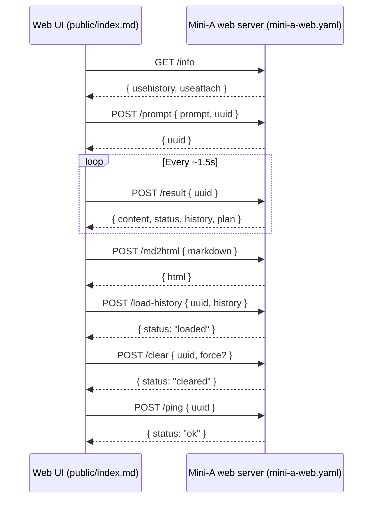

# Mini-A Web Backend Endpoints (UI Interactions)

This document describes the backend endpoints that the web UI (`public/index.md`) calls and how they map to the HTTP services defined in `mini-a-web.yaml`. The focus is on the runtime request/response shapes used by the UI, not the static asset routes.

## Quick map

| Endpoint | Method | Purpose (UI) | Primary caller in UI |
| --- | --- | --- | --- |
| `/info` | GET | Discover feature flags (history, attachments). | `configureFeatureAvailability()` |
| `/prompt` | POST | Submit a user prompt to start/resume a session. | `handleSubmit()`, `handleRetryLastAnswer()` |
| `/result` | POST | Poll for streaming/finished results; stop a running session. | `startPolling()`, `ensureConversationContentForCopy()`, `refreshCurrentConversationView()`, `stopProcessing()` |
| `/md2html` | POST | Convert Markdown to static HTML for export. | `handleExportHtml()` |
| `/load-history` | POST | Push local history into the server (resume/branch). | `sendHistoryToServer()` |
| `/clear` | POST | Clear a session (and optionally force-delete history). | `handleClearClick()`, `handleHistoryEntryDelete()`, `handleClearHistoryStorage()` |
| `/ping` | POST | Keep a session alive during idle UI usage. | `startPing()` / `sendPing()` |

## Endpoint details

### `GET /info`

**Frontend usage**
- Called on initial load to decide whether to show the history panel and attachment UI.
- UI expects JSON with `usehistory` and `useattach` booleans.

**Response (example)**
```json
{
  "status": "ok",
  "usehistory": true,
  "useattach": false,
  "historyretention": 600,
  "showexecs": false
}
```

**Backend implementation notes**
- Returns server configuration flags for UI feature toggles.

### `POST /prompt`

**Frontend usage**
- Starts a new conversation or continues an existing one.
- UI sends `prompt` and optional `uuid` to bind to the current session.

**Request body**
```json
{ "prompt": "...", "uuid": "..." }
```

**Response**
```json
{ "uuid": "..." }
```

**Backend implementation notes**
- Initializes a `MiniA` instance on first use of a `uuid` and stores results in the in-memory session map.
- Returns `uuid` for the client to keep the session stable.

### `POST /result`

**Frontend usage**
- Polls for updated output while the model is running.
- Also used to retrieve the latest content for copy/export routines.
- When stopping a running interaction, sends a `request: "stop"` flag.

**Request body (poll)**
```json
{ "uuid": "..." }
```

**Request body (stop)**
```json
{ "uuid": "...", "request": "stop" }
```

**Response (example)**
```json
{
  "content": "<html-or-markdown-content>",
  "status": "processing",
  "history": [{ "event": "👤", "message": "..." }],
  "plan": {
    "active": true,
    "items": ["..."],
    "total": 3,
    "completed": 1,
    "overall": 33,
    "checkpoints": { "reached": 1, "total": 2 },
    "updated": 1710000000000
  }
}
```

**Backend implementation notes**
- Builds `content` by aggregating session events into a markdown/HTML stream.
- Emits `status: "finished"` once a final answer is stored.
- Responds with plan metadata for the plan panel UI.

### `POST /md2html`

**Frontend usage**
- Converts the conversation Markdown into static HTML for download/export.

**Request body**
```json
{ "markdown": "..." }
```

**Response**
```json
{ "html": "<html>...</html>" }
```

**Backend implementation notes**
- Uses the server-side Markdown renderer to produce a standalone HTML document.

### `POST /load-history`

**Frontend usage**
- When branching or resuming from local history, sends UI-cached events to the backend.
- Allows the server to reconstruct session state for a given `uuid`.

**Request body**
```json
{
  "uuid": "...",
  "history": [
    { "event": "👤", "message": "Prompt" },
    { "event": "final", "message": "Answer" }
  ]
}
```

**Response**
```json
{ "status": "loaded", "uuid": "...", "entries": 2 }
```

**Backend implementation notes**
- Sanitizes and stores the provided events in the in-memory session store.
- Clears any existing conversation object to force rebuilding on the next prompt.

### `POST /clear`

**Frontend usage**
- Clears the current session when the user clicks "Clear" or deletes history entries.
- When used from history actions, `force: true` ensures the server clears even if history is enabled.

**Request body**
```json
{ "uuid": "...", "force": true }
```

**Response**
```json
{ "status": "cleared" }
```

**Backend implementation notes**
- Removes session data, plan state, and optionally any stored history files.

### `POST /ping`

**Frontend usage**
- Periodically pings to keep a session alive while the UI is open.

**Request body**
```json
{ "uuid": "..." }
```

**Response**
```json
{ "status": "ok" }
```

**Backend implementation notes**
- Lightweight keep-alive handler. Primarily used to avoid session cleanup during inactivity.

## Flow diagram (UI ↔ server)


